# [Design] Jo:YUl (종합 모임 관리 및 조율 시스템)

| Student No | Name | E-Mail |
| :--- | :--- | :--- |
| 22411923 | 홍주은 | goldong23@yu.ac.kr |

## [ 개정 이력 ]

| 개정일 | 버전 | 변경 내용 | 작성자 |
| :--- | :--- | :--- | :--- |
| 2026-05-29 | 1.00 | First Draft | 홍주은 |
| 2026-06-03 | 1.02 | 구현 플랫폼 및 개발 환경 보완 | 홍주은 |
| 2026-06-14 | 1.04 | 회원가입, 로그인 오류 처리, 이메일 인증, 권한 선택, 로그아웃, 회원탈퇴, 닉네임 초대, 일정 추천/확정, 산출물 업로드, 이벤트 투표, 앱 아이콘 기능 추가 | 홍주은 |
| 2026-06-15 | 1.05 | 팀 단위 이벤트별 워크스페이스, 첨부파일 열람 정보, 일정 입력 UI 상태 보존 설계 보완 | 홍주은 |

## = Contents =

1. Introduction
2. Class diagram
3. Sequence diagram
4. State machine diagram
5. Implementation requirements
6. Glossary
7. Reference

---

## 1. Introduction

Jo:YUl(조율)은 대학생 팀 프로젝트, 스터디, 친목 모임 등에서 반복적으로 발생하는 일정 조율, 공지 전달, 과제 제출, 이벤트 참여자 분리 문제를 하나의 모바일 중심 시스템에서 해결하기 위한 종합 모임 관리 프로그램이다.

기존 메신저 기반 모임 운영은 일정 조율 메시지, 공지, 파일 제출, 참여 여부 확인이 한 공간에 섞여 정보 누락과 피로감을 만든다. Jo:YUl은 팀 생성 이후 일정 조율, 과제 관리, 이벤트 투표, 이벤트 참여자 전용 워크스페이스 생성을 하나의 흐름으로 제공하여 모임 운영자가 반복적으로 수행하던 조율 작업을 줄이는 것을 목표로 한다.

본 문서는 Jo:YUl 서비스의 주요 기능을 객체, 기능 수행 절차, 시스템 상태 변화 관점에서 구체화한다. 회원가입과 로그인으로 사용자를 식별하고, 팀 생성과 초대를 통해 모임 단위를 구성하며, 일정 조율, 과제 관리, 이벤트 투표는 모두 팀을 기준으로 분리한다. 또한 이벤트 투표 결과에 따라 이벤트별로 독립된 워크스페이스를 생성하여 불필요한 전체 공지와 메시지 혼선을 줄인다.

Jo:YUl의 핵심 설계 방향은 모임 운영 과정에서 반복되는 조율 업무를 시스템이 대신 정리하도록 하는 것이다. 팀은 일정, 과제, 이벤트의 소유 경계가 되며 사용자는 본인이 소유하거나 초대된 팀의 데이터만 조회한다. 사용자는 자신의 불가능 시간을 입력하고, 관리자는 추천된 일정을 확정하며, 과제 제출과 이벤트 참여 여부는 사용자와 팀, 이벤트 식별자를 기준으로 분리된 상태 정보로 관리된다. 이를 통해 팀원은 필요한 정보만 확인하고, 관리자는 모임 진행 상황을 명확하게 파악할 수 있다.

---

## 2. Class diagram

아래의 그림은 Jo:YUl 시스템의 주요 도메인 Class Diagram을 표현한 것이다. 클래스는 회원, 팀, 일정, 과제, 이벤트, 워크스페이스, 알림, 저장소 객체를 중심으로 구성되며, 각 클래스의 속성, 메소드, 상속 관계, 포함 관계, 다중성을 함께 표현한다.

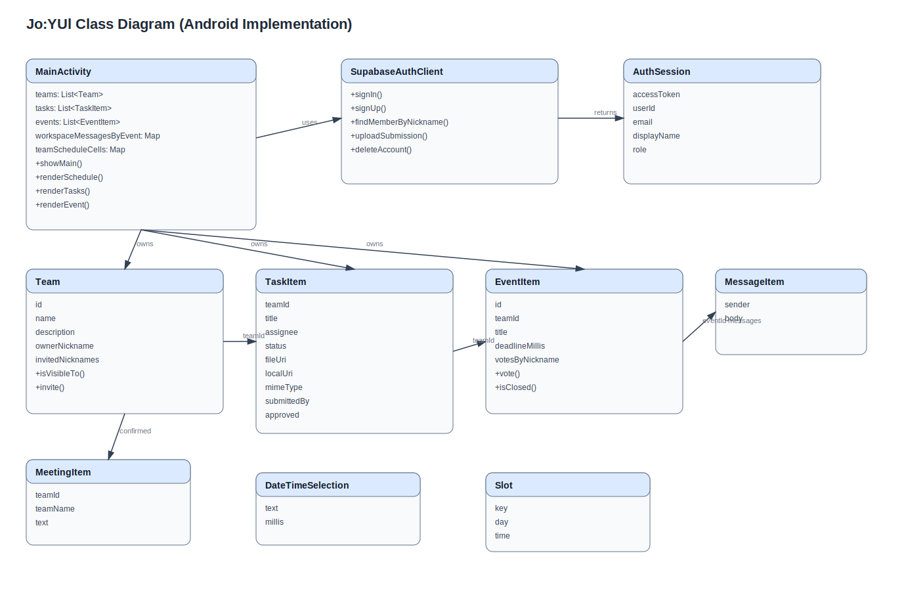

### 2.1 Class description

아래의 표는 위 Class Diagram에서 표현한 클래스들에 대한 설명이다.

| Class Name | Explanation |
| :--- | :--- |
| `Member` | Jo:YUl을 사용하는 기본 회원을 표현한다. Supabase 사용자 ID, 이메일, 중복되지 않는 닉네임, 권한 정보를 가지며 팀 가입, 이벤트 투표 등의 기능을 수행한다. 권한은 `member` 또는 `admin`으로 구분된다. |
| `Administrator` | `Member`를 상속하는 관리자 클래스이다. 팀 생성, 팀원 초대, 일정 확정, 제출물 승인 같은 관리 기능을 수행한다. |
| `AuthAccount` | Supabase Auth와 연결되는 인증 계정 정보를 표현한다. 이메일, Supabase에서 관리하는 비밀번호 해시, 마지막 로그인 시간, 인증 여부를 가진다. 앱 내부에는 원문 비밀번호를 저장하지 않는다. |
| `Notification` | 팀 초대, 일정 확정, 과제 제출, 이벤트 투표 요청 등 사용자에게 전달되는 알림을 표현한다. |
| `Team` | 프로젝트 팀, 스터디, 모임을 나타내는 aggregate root이다. 팀 정보와 팀 상태를 관리하며 멤버, 일정, 과제, 이벤트의 조회 범위를 결정하는 소유 경계가 된다. |
| `TeamMember` | `Member`와 `Team`의 다대다 관계를 표현하는 association class이다. 팀 내 역할과 가입 일자를 저장한다. |
| `ScheduleBlock` | 멤버가 입력한 참석 불가능 시간 또는 일정 블록을 표현한다. 팀, 멤버, 요일, 시작 시간, 종료 시간을 가지며 다른 팀의 일정 계산에는 포함되지 않는다. |
| `ScheduleRecommendation` | 팀원들의 일정 블록을 비교하여 계산된 추천 시간 후보를 표현하는 value object이다. |
| `Task` | 팀에서 수행해야 하는 과제 또는 미션을 표현한다. 담당자, 마감일, 진행 상태를 관리한다. |
| `Submission` | 특정 과제에 대해 멤버가 제출한 산출물을 표현한다. 제출자, 파일 URL, 원본 파일 URI, MIME type, 제출 상태, 제출 시간을 가진다. |
| `FileAttachment` | 제출물에 첨부되는 파일 정보를 표현하는 value object이다. 파일명, 파일 URL, MIME type, 업로드 시간, 클라이언트 열람 URI를 관리한다. |
| `DataStore` | 도메인 객체의 저장, 조회, 수정 기능을 담당하는 repository 클래스이다. |
| `Event` | 참여 여부 투표가 필요한 모임 이벤트를 표현한다. 팀 ID, 이벤트 ID, 투표 마감 시간과 이벤트 상태를 관리한다. |
| `Vote` | 특정 이벤트에 대한 멤버의 참여, 불참, 미응답 상태를 표현한다. |
| `TeamWorkspace` | 특정 이벤트의 참여자로 확정된 멤버들이 사용하는 임시 워크스페이스를 표현한다. 워크스페이스는 이벤트 ID별로 독립 생성된다. |
| `WorkspaceMessage` | 워크스페이스 안에서 작성되는 메시지를 표현한다. 이벤트 ID, 작성자, 내용, 작성 시간을 가진다. |
| `FileStorage` | 과제 제출물 파일의 업로드를 담당한다. |

### 2.2 Domain boundary rules

Jo:YUl은 `Team`을 일정, 과제, 이벤트의 상위 aggregate로 사용한다. 사용자가 팀 소유자이거나 팀 초대 명단에 포함된 경우에만 해당 팀의 하위 데이터를 조회할 수 있다. 이 규칙은 Home의 팀 목록뿐 아니라 일정 탭, 과제 탭, 이벤트 탭, 확정 일정 안내에도 동일하게 적용된다.

일정 데이터는 `teamId -> memberId -> scheduleBlock` 구조로 분리한다. 따라서 같은 사용자가 여러 팀에 속해 있어도 한 팀에서 입력한 불가능 시간이 다른 팀의 추천 계산에 섞이지 않는다. 과제와 이벤트 역시 `teamId`를 저장하여 팀별 섹션으로 렌더링한다.

워크스페이스는 팀 전체 단위가 아니라 이벤트 단위로 생성한다. 하나의 팀에 여러 이벤트가 존재할 수 있으므로 `TeamWorkspace`는 `eventId`를 기준으로 메시지 목록을 분리한다. 사용자가 여러 이벤트에 참여한 경우 이벤트별 워크스페이스 카드가 각각 표시되며, 메시지는 해당 이벤트의 워크스페이스 안에서만 조회된다.

첨부파일은 제출 데이터와 파일 메타데이터를 함께 저장한다. 제출자와 관리자는 파일명, MIME type, 저장 경로, 클라이언트 열람 URI를 확인할 수 있으며, 다른 회원은 제출 존재 여부만 확인한다. 이 구조는 산출물의 소유권과 열람 권한을 분리하여 관리하기 위한 것이다.

---

## 3. Sequence diagram

아래에 나오는 그림들은 Conceptualization에서 표현한 주요 기능들을 Sequence Diagram으로 표현한 것이다. 각 기능은 사용자의 UI 조작, 서비스 클래스의 처리, 저장소 또는 알림 서비스와의 상호작용 순서로 설명한다.

### 3.1 Register member

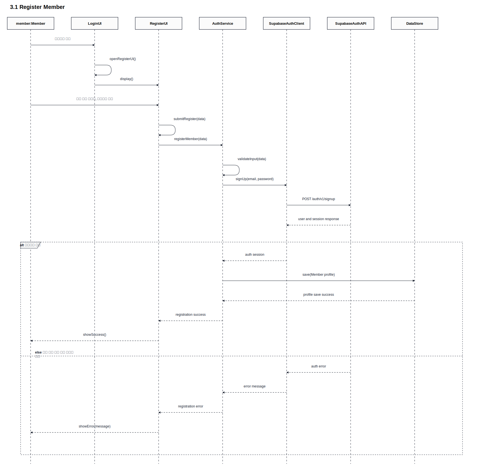

회원가입 기능은 로그인 화면에서 사용자가 `회원가입`을 선택하면 별도의 회원 등록 화면을 표시하는 과정에서 시작된다. 사용자는 앱에서 사용할 닉네임, 이메일, 비밀번호, 비밀번호 확인 값, 권한 유형(회원 또는 관리자)을 입력한다. `AuthService`는 필수값, 이메일 형식, 비밀번호 길이, 비밀번호 확인 일치 여부와 닉네임 중복 여부를 검증한다. `SupabaseAuthClient`는 `members` 테이블에서 닉네임 중복을 먼저 확인하고, 입력된 이메일과 비밀번호로 Supabase Auth의 `/auth/v1/signup` API에 가입 요청을 보낸다. 닉네임과 권한은 Supabase Auth `user_metadata`와 `members` 테이블에 함께 저장한다. 가입이 성공하면 Supabase Auth user store에 인증 계정이 저장되고 세션이 생성되어 Home 화면으로 이동한다. 비밀번호는 앱 내부 DB에 저장하지 않고 Supabase Auth에서 관리한다.

### 3.2 Login

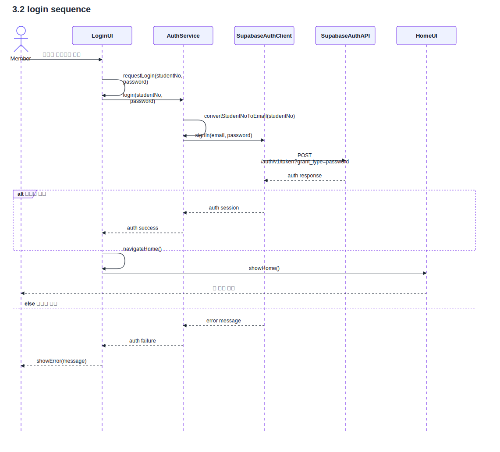

로그인 기능은 사용자가 입력한 이메일과 비밀번호를 Supabase Auth에 전달하여 세션을 요청하는 과정이다. Supabase가 세션을 반환하면 Home 화면으로 이동한다. Supabase가 `Invalid login credentials`를 반환하는 경우 앱은 원문 오류를 그대로 표시하지 않고 `회원이 아닙니다. 회원가입을 진행해주세요.`라는 사용자 안내 메시지로 변환한 뒤 로그인 입력 상태로 돌아간다.

로그인 후 앱은 Supabase Auth `user_metadata`에 저장된 닉네임과 권한을 읽어 현재 사용자 정보를 구성한다. 권한이 `admin`인 사용자만 팀 생성, 과제 생성, 과제 승인, 이벤트 생성, 일정 확정 같은 관리자 기능을 사용할 수 있다. 권한이 `member`인 사용자는 자신이 초대된 팀과 관련된 과제, 이벤트를 확인하고 일정 입력, 산출물 제출, 이벤트 투표 같은 회원 기능만 사용할 수 있다.

사용자는 Home 화면에서 로그아웃할 수 있다. 로그아웃을 수행하면 현재 사용자 이름, 권한, 선택 중인 탭, 일정 추천 상태를 초기화하고 로그인 화면으로 돌아간다.

회원탈퇴 기능은 앱이 현재 로그인 세션의 access token을 서버 함수에 전달하여 수행된다. 서버 함수는 Supabase service role 권한으로 사용자 관련 테이블 데이터를 삭제한 뒤 Supabase Auth 계정을 삭제한다. service role key는 Android 앱에 포함하지 않고 서버 환경 변수로만 관리한다.

### 3.3 Create Team

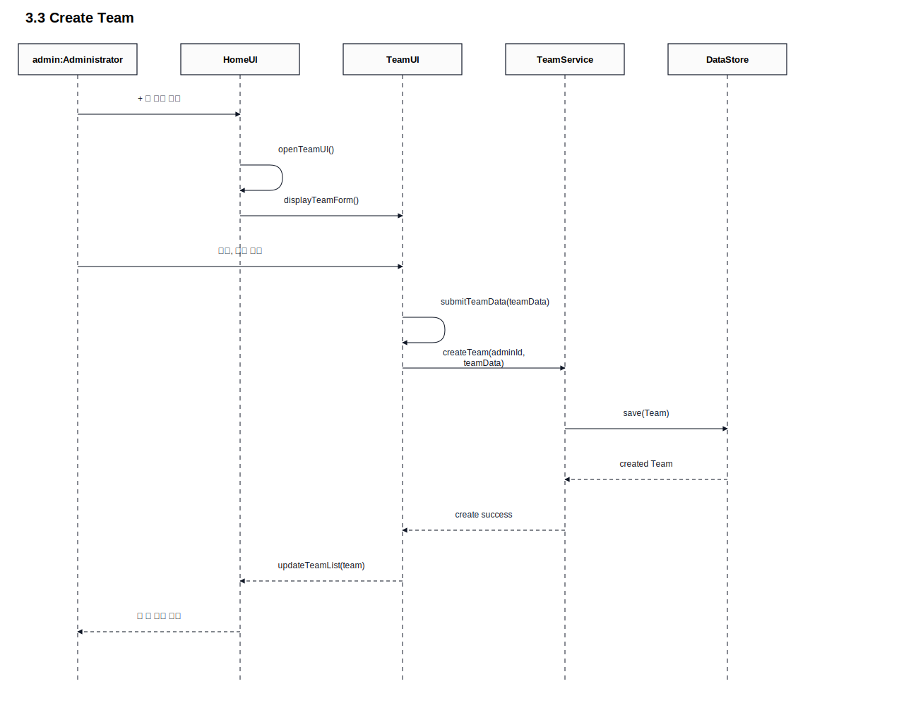

팀 생성 기능은 관리자가 새로운 프로젝트 또는 스터디 그룹을 만들 때 사용한다. 팀이 생성되면 팀 목록에 새 팀이 추가되고 이후 멤버 초대, 일정 조율, 과제 관리, 이벤트 관리의 기준 단위가 된다. 팀 소유자와 초대된 멤버만 해당 팀의 하위 데이터를 조회할 수 있다.

### 3.4 Invite Member

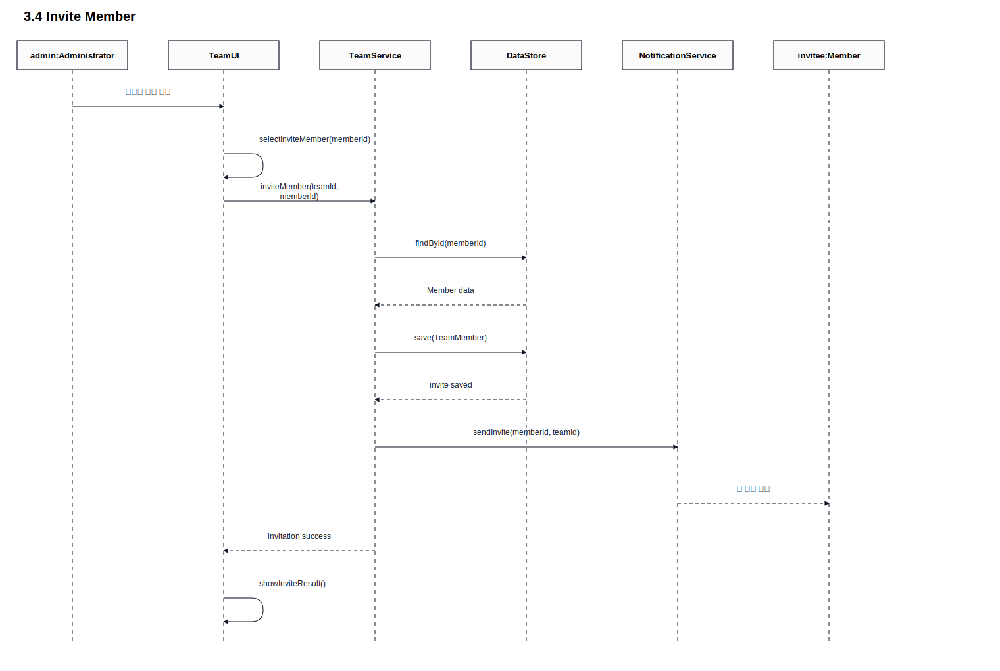

팀원 초대 기능은 관리자가 팀 카드에서 가입된 회원의 닉네임을 입력하는 방식으로 수행된다. 관리자가 닉네임을 입력하면 앱은 `members` 테이블에서 해당 닉네임의 가입 여부를 조회한다. 가입된 닉네임이면 해당 회원을 팀 초대 명단에 추가하고 팀 멤버 수를 갱신한다. 초대받기 전의 회원에게는 해당 팀이 홈 화면의 팀 목록에 표시되지 않으며, 팀 소유자와 초대된 회원에게만 팀 카드가 표시된다.

### 3.5 Input Schedule

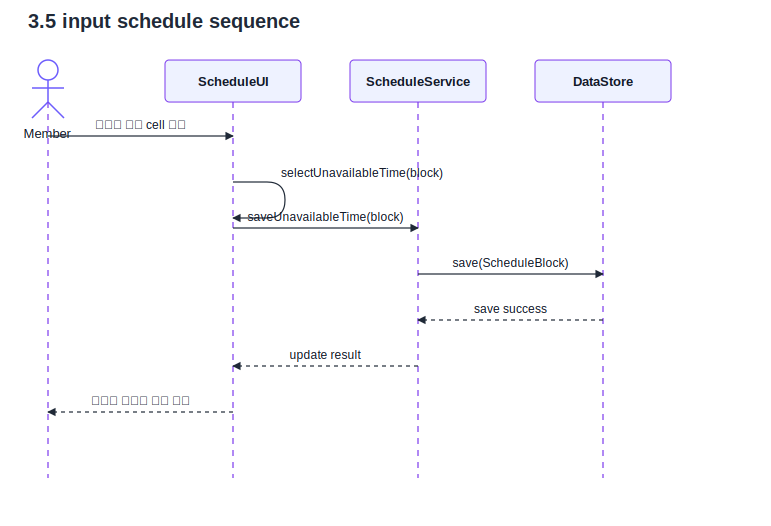

일정 입력 기능은 사용자가 텍스트로 시간을 입력하는 대신 캘린더 cell을 선택하여 참석 불가능 시간을 표시하는 방식이다. 시간표는 09시부터 23시까지 입력할 수 있으며, 저장된 불가능 시간은 현재 선택된 팀의 일정 추천에만 사용된다. 블록 선택은 화면 전체를 다시 렌더링하지 않고 해당 cell의 상태만 갱신하여 사용자의 스크롤 위치를 유지한다.

### 3.6 Decide Schedule

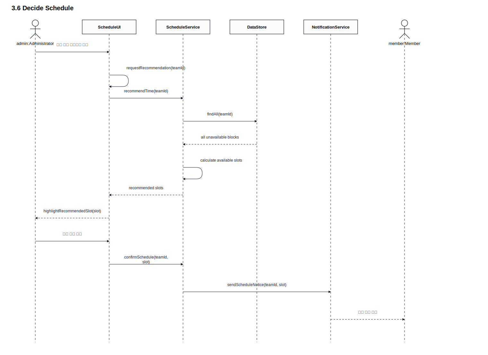

일정 확정 기능은 팀원들이 입력한 불가능 시간을 제외하고 모든 참여자가 참석 가능한 시간 전체를 시간표에 표시한다. 최적 시간 추천과 일정 확정 버튼은 관리자에게만 표시된다. 관리자는 시간표 바로 아래에서 년, 월, 일, 시, 분을 스크롤 선택 방식으로 입력하여 일정을 확정한다. 확정 일정은 팀별로 저장되며 Home 화면에는 사용자가 조회 가능한 팀의 확정 일정이 `(팀 이름) : 확정 일시에 만나요 !` 형식으로 여러 개 표시될 수 있다.

### 3.7 Upload Task

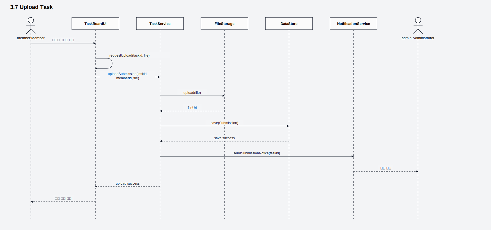

과제 업로드 기능은 멤버가 Android 파일 선택기를 통해 사진, PDF, 텍스트 파일, 압축 파일 등 실제 산출물 파일을 선택하여 제출하는 기능이다. 선택된 파일은 Supabase Storage의 제출물 저장소에 업로드되고, 업로드된 object path가 `Submission` 또는 과제 제출 정보에 연결된다. 제출이 완료되면 제출자 닉네임, 파일명, MIME type, 저장 경로, 원본 파일 URI가 함께 저장된다. 이후 재업로드는 최초 제출한 계정에서만 가능하다. 다른 회원 계정은 이미 제출된 산출물을 다시 업로드할 수 없고, 관리자는 제출 파일과 제출자를 확인할 수 있다.

### 3.8 Approve Task

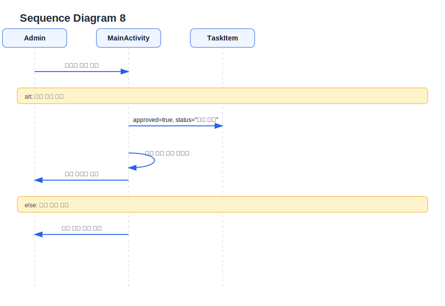

과제 승인 기능은 관리자가 제출된 산출물을 검토하고 승인 또는 반려하는 기능이다. 승인된 제출물은 팀 진행률에 반영되고, 반려된 제출물은 재제출 대상으로 표시된다.

### 3.9 Manage Event & Notification

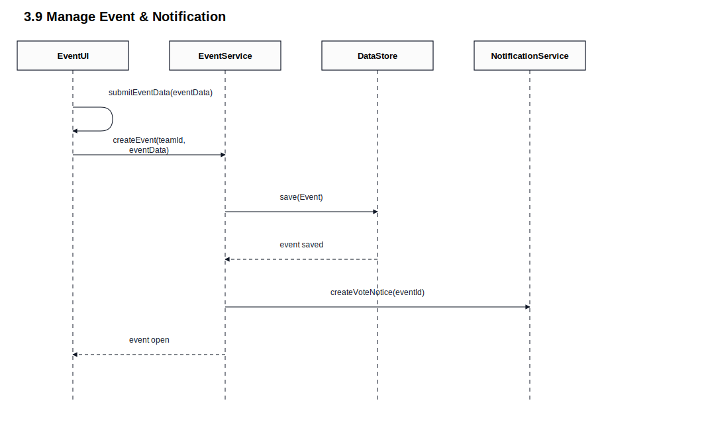

이벤트 및 알림 관리 기능은 관리자가 이벤트를 생성하고 멤버에게 참여 여부 투표를 요청하는 과정이다. 관리자는 이벤트 제목과 설명을 입력한 뒤 일정 확정 입력과 같은 스크롤 방식으로 투표 마감 년, 월, 일, 시, 분을 선택한다. 이벤트가 생성되면 회원 화면에는 투표 마감 시각과 남은 시간이 표시된다.

### 3.10 Vote Event

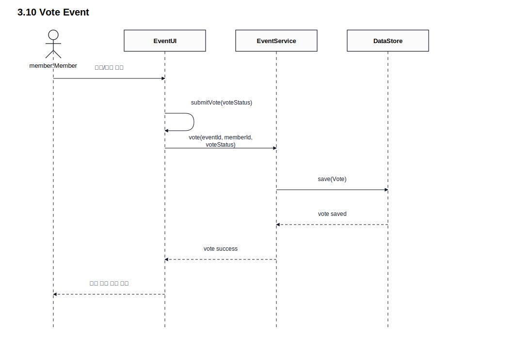

이벤트 투표 기능은 사용자가 특정 이벤트에 대해 참여 또는 불참 의사를 제출하는 기능이다. 투표 결과는 사용자 계정별로 분리하여 저장되므로 한 계정에서 수행한 투표가 다른 계정의 투표 상태에 영향을 주지 않는다. 투표 마감 시간이 지나면 투표 버튼을 표시하지 않고 마감 안내를 보여준다. 투표 결과는 이벤트 확정과 워크스페이스 생성 여부를 결정하는 기준이 된다.

### 3.11 Alert Vote

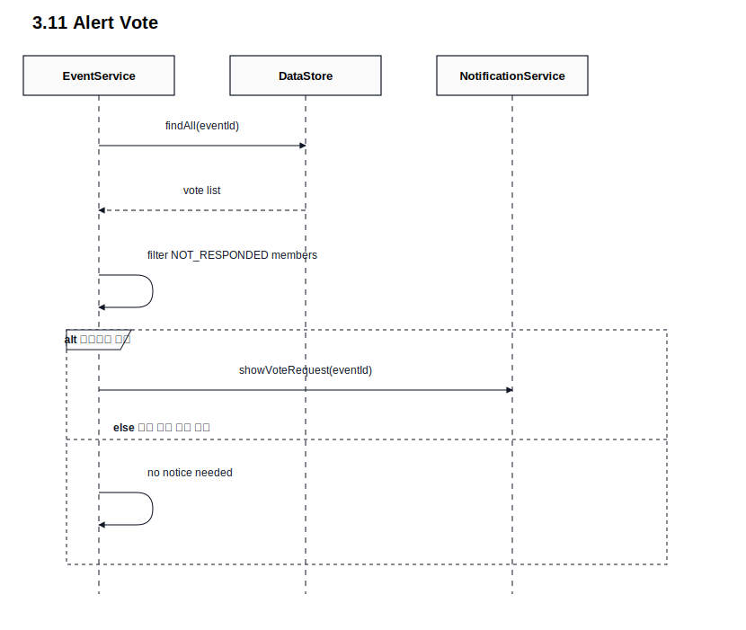

투표 알림 기능은 이벤트 마감 전 미투표자를 찾아 리마인드 알림을 보내는 기능이다. 모든 멤버가 투표를 완료한 경우 리마인드 알림은 생략된다.

### 3.12 Decide Event

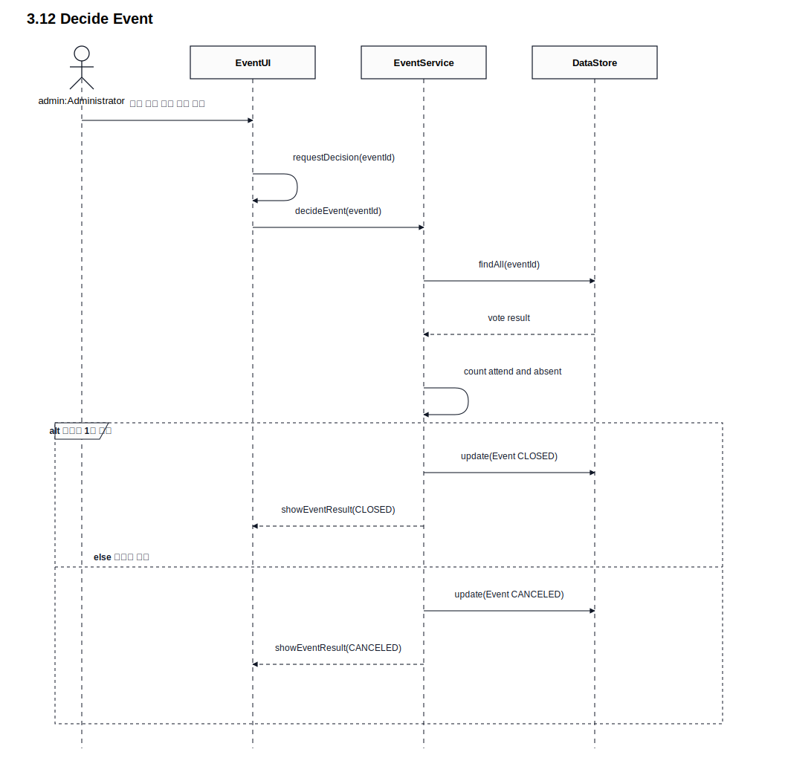

이벤트 확정 기능은 참여/불참 투표 결과를 바탕으로 이벤트 진행 여부를 결정한다. 참여자가 없으면 이벤트를 취소하고, 참여자가 있으면 워크스페이스 생성 단계로 넘어간다.

### 3.13 Create Team Workspace

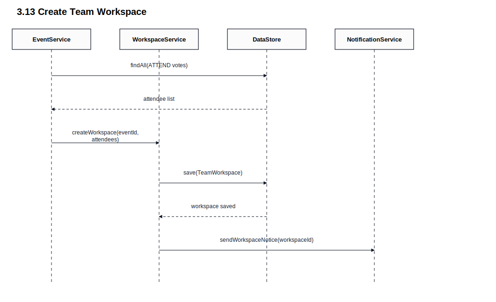

팀 워크스페이스 생성 기능은 이벤트 참여자로 확정된 멤버만 포함하는 임시 소통 공간을 자동으로 만드는 기능이다. 워크스페이스는 팀 단위 공용 공간이 아니라 이벤트 ID별 공간으로 생성된다. 참여자가 없으면 워크스페이스를 생성하지 않는다.

### 3.14 Manage Team Workspace

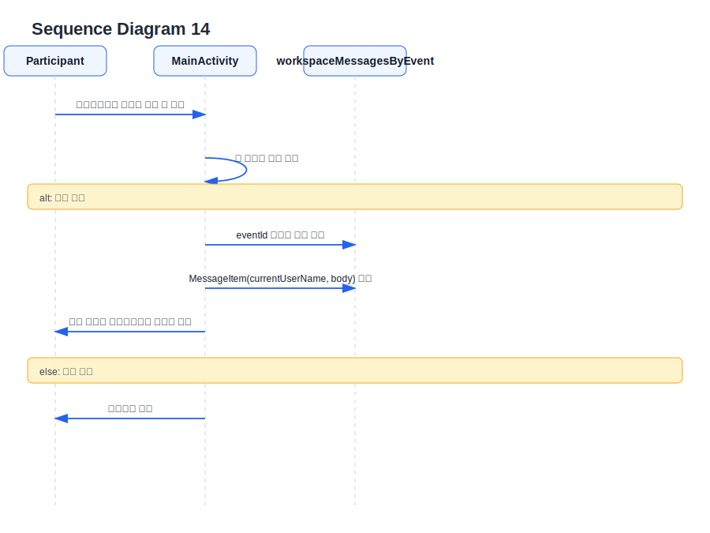

팀 워크스페이스 관리 기능은 참여자 전용 채팅/공지 공간에서 메시지를 주고받는 기능이다. 해당 이벤트의 워크스페이스에 포함된 멤버만 메시지를 확인하고 작성할 수 있으며, 같은 팀 안의 다른 이벤트 워크스페이스 메시지와는 분리된다.

---

## 4. State machine diagram

아래의 그림은 Jo:YUl 시스템의 전체 상태 흐름을 표현한 State Machine Diagram이다. 사용자는 시스템 실행 후 로그인 화면에 진입하며, 로그인 화면에서 회원가입 화면으로 이동하거나 로그인 검증을 수행한다. 인증이 성공하면 Home에 진입하고, Home에서 일정, 과제, 이벤트, 워크스페이스 기능으로 이동한다.

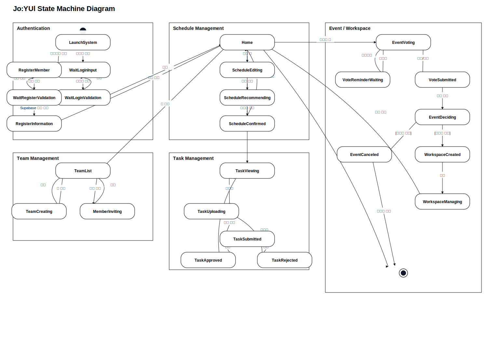

### 4.1 State description

아래의 표는 위 State Machine Diagram에 나온 각 State에 대한 설명이다.

| State | Explanation |
| :--- | :--- |
| `LaunchSystem` | 사용자가 Jo:YUl 시스템을 실행한 초기 상태이다. |
| `RegisterMember` | 사용자가 별도 회원가입 화면에서 닉네임, 이메일, 비밀번호, 비밀번호 확인, 회원/관리자 권한 값을 입력하는 상태이다. |
| `WaitRegisterValidation` | 회원가입 입력값 검증과 Supabase Auth 가입 요청 결과를 기다리는 상태이다. 이미 가입된 계정, 닉네임 누락, 닉네임 중복, 이메일 형식 오류, 비밀번호 길이, 필수값 누락, 비밀번호 확인 불일치 등을 검사한다. |
| `RegisterInformation` | Supabase Auth 가입이 성공한 뒤 Auth user store에 계정이 생성되고 앱 세션을 준비하는 상태이다. |
| `WaitLoginInput` | 로그인하기 위해 이메일과 비밀번호 입력을 기다리는 상태이다. |
| `WaitLoginValidation` | 입력한 이메일과 비밀번호를 Supabase Auth에 전달하여 인증 결과를 기다리는 상태이다. 미가입 계정으로 판단되면 `회원이 아닙니다. 회원가입을 진행해주세요.` 안내를 표시하고 다시 로그인 입력 상태로 돌아간다. |
| `Home` | 로그인 성공 후 시스템 내부에 진입한 상태이다. 사용자가 조회 가능한 팀 목록, 팀별 확정 일정 안내, 이벤트 투표 카드가 표시된다. |
| `Logout` | 사용자가 Home 화면에서 로그아웃을 선택하여 앱 세션 정보를 초기화하고 로그인 화면으로 돌아가는 전이 동작이다. |
| `TeamList` | 사용자가 소유하거나 초대된 팀 목록과 각 팀의 진행률을 확인하는 상태이다. |
| `TeamCreating` | 관리자가 새 팀을 생성하는 상태이다. |
| `MemberInviting` | 관리자가 팀에 멤버를 초대하는 상태이다. 초대가 완료되면 팀 멤버 목록이 갱신된다. |
| `ScheduleEditing` | 사용자가 일정 탭에서 현재 팀의 참석 불가능한 시간을 선택하는 상태이다. cell 상태만 갱신하여 스크롤 위치를 유지한다. |
| `ScheduleRecommending` | 관리자가 현재 팀원들의 불가능 시간 블록을 비교하여 전원 참석 가능한 시간 전체를 계산하는 상태이다. |
| `ScheduleConfirmed` | 관리자가 스크롤 입력으로 년, 월, 일, 시, 분을 선택하여 최종 모임 시간을 확정한 상태이다. |
| `TaskViewing` | 과제 탭에서 팀별 진행률과 과제별 제출 상태를 확인하는 상태이다. 초대되지 않은 팀의 과제는 표시하지 않는다. |
| `TaskUploading` | 멤버가 과제 산출물을 업로드하는 상태이다. 제출물이 이미 있으면 최초 제출 계정만 다시 업로드할 수 있고, 제출자와 관리자는 파일명, MIME type, 저장 경로를 확인할 수 있다. |
| `TaskSubmitted` | 제출물이 저장되고 관리자 확인을 기다리는 상태이다. |
| `TaskApproved` | 관리자가 제출물을 승인하여 과제 진행률이 갱신된 상태이다. |
| `TaskRejected` | 관리자가 제출물을 반려하여 멤버가 재제출해야 하는 상태이다. |
| `EventVoting` | 사용자가 이벤트 탭에서 팀별 이벤트의 남은 시간을 확인하고 마감 전 참여 또는 불참을 선택하는 상태이다. 초대되지 않은 팀의 이벤트는 표시하지 않는다. |
| `VoteReminderWaiting` | 아직 투표하지 않은 사용자가 리마인드 알림을 기다리는 상태이다. |
| `VoteSubmitted` | 사용자가 이벤트 참여/불참 투표를 완료한 상태이다. |
| `EventDeciding` | 투표 마감 후 참여자 수를 기준으로 이벤트 진행 여부를 결정하는 상태이다. |
| `EventCanceled` | 참여자가 없거나 조건을 만족하지 못해 이벤트가 취소된 상태이다. |
| `WorkspaceCreated` | 참여자만 포함한 이벤트별 임시 워크스페이스가 생성된 상태이다. |
| `WorkspaceManaging` | 참여자 전용 이벤트 워크스페이스에서 메시지와 공지를 주고받는 상태이다. 메시지는 이벤트 ID별로 분리된다. |

관리자 전용 상태(`TeamCreating`, `MemberInviting`, `ScheduleConfirmed`, `TaskApproved`, 이벤트 생성 관련 동작)는 현재 사용자의 권한이 `admin`일 때만 진입할 수 있다. 팀, 과제, 이벤트 정보는 현재 사용자가 소유하거나 초대된 팀의 데이터만 기준으로 표시한다.

---

## 5. Implementation requirements

Jo:YUl 시스템을 구동하기 위해 필요한 구현 환경 요구사항은 아래와 같다.

### 5.1 H/W platform requirements

| Item | Requirement |
| :--- | :--- |
| Target Device | Android 스마트폰 또는 Android 에뮬레이터 |
| CPU | ARM 64-bit 또는 동등한 Android 지원 프로세서 |
| RAM | 4GB 이상 권장 |
| Storage | 앱 설치 및 제출 파일 임시 저장을 위한 500MB 이상의 여유 공간 |
| Network | 서버 통신 및 알림 수신을 위한 Wi-Fi 또는 모바일 네트워크 |

### 5.2 S/W platform requirements

| Item | Requirement |
| :--- | :--- |
| Operating System | Android 8.0(Oreo) 이상 |
| Development Tool | Android Studio |
| Implementation Language | Kotlin 또는 Java |
| Build Tool | Gradle |
| Output File | Android `.apk` file |
| App Icon | Android adaptive icon. 파란색-청록색 그라데이션 배경과 safe zone 안에 배치된 Jo:YUl 모노그램을 사용한다. |
| Server Interface | Supabase Auth REST API, Supabase REST API, Supabase Edge Function |
| Invitation | 관리자가 가입된 회원의 닉네임을 입력하여 팀에 초대한다. 초대 전에는 해당 팀이 회원의 팀 목록에 표시되지 않는다. |
| Team Data Scope | 일정, 과제, 이벤트, 확정 일정은 `teamId`를 기준으로 분리하고 팀 소유자 또는 초대된 멤버에게만 표시한다. |
| Database | Supabase PostgreSQL 및 Supabase Auth user store |
| File Storage | Supabase Storage. 과제 산출물 파일은 `submissions` bucket에 저장하며, authenticated 사용자의 insert/select Storage policy가 필요하다. 앱은 파일명, MIME type, 저장 경로, 클라이언트 열람 URI를 제출 정보와 함께 관리한다. |
| Workspace Scope | 이벤트 참여자로 확정된 사용자를 기준으로 `eventId`별 워크스페이스를 구성한다. 같은 팀의 이벤트라도 워크스페이스 메시지는 서로 공유하지 않는다. |
| Account Deletion | Supabase Edge Function. service role key를 서버 환경 변수로 사용하여 Auth user와 관련 DB 데이터를 삭제한다. |

---

## 6. Glossary

| Terms | Description |
| :--- | :--- |
| `Supabase` | Jo:YUl에서 회원가입과 로그인을 처리하기 위해 사용하는 Backend-as-a-Service 플랫폼이다. |
| `Nickname` | 앱 안에서 사용자를 식별하는 고유 표시 이름이다. 팀 초대 시 닉네임으로 가입 회원을 조회하므로 중복을 허용하지 않는다. |
| `Member` | Jo:YUl을 사용하는 일반 회원이다. 일정 입력, 과제 업로드, 이벤트 투표를 수행한다. |
| `Administrator` | 팀 생성, 팀원 초대, 일정 확정, 과제 승인, 이벤트 생성을 수행하는 사용자이다. |
| `Team` | 프로젝트 팀, 스터디, 모임을 나타내는 단위이다. 일정, 과제, 이벤트 데이터의 조회 경계가 된다. |
| `ScheduleBlock` | 사용자가 참석할 수 없는 시간을 캘린더에 블록으로 표시한 데이터이다. |
| `Task` | 팀 내에서 수행해야 하는 과제 또는 미션이다. |
| `Submission` | 멤버가 과제에 대해 제출한 산출물 데이터이다. 제출자, 파일명, MIME type, 저장 경로, 열람 URI를 포함한다. |
| `Event` | 참여/불참 투표가 필요한 회식, 친목 모임, 임시 모임 등의 일정이다. 이벤트별 워크스페이스의 생성 기준이 된다. |
| `Vote` | 이벤트에 대한 멤버의 참여, 불참, 미응답 상태이다. |
| `TeamWorkspace` | 특정 이벤트의 참여자로 확정된 멤버만 사용하는 임시 소통 공간이다. 이벤트 ID별로 분리된다. |
| `Notification` | 투표 요청, 일정 확정, 제출 알림 등 사용자에게 전달되는 시스템 메시지이다. |

---

## 7. Reference

1. [Object Management Group, Unified Modeling Language Specification Version 2.5.1](https://www.omg.org/spec/UML/2.5.1/About-UML)
2. [Android Developers, Guide to app architecture](https://developer.android.com/topic/architecture)
3. [Android Developers, Adaptive icons](https://developer.android.com/develop/ui/views/launch/icon_design_adaptive)
4. [Android Developers, Access documents and other files from shared storage](https://developer.android.com/training/data-storage/shared/documents-files)
5. [Supabase Docs, Managing user data](https://supabase.com/docs/guides/auth/managing-user-data)
6. [Supabase Docs, Storage access control](https://supabase.com/docs/guides/storage/security/access-control)
