# [Design] Jo:YUl (종합 모임 관리 및 조율 시스템)

| Student No | Name | E-Mail |
| :--- | :--- | :--- |
| 22411923 | 홍주은 | goldong23@yu.ac.kr |

## [ Revision history ]

| Revision date | Version # | Description | Author |
| :--- | :--- | :--- | :--- |
| 2026-05-29 | 1.00 | First draft | 홍주은 |
| 2026-06-02 | 1.01 | Reorganized design document with class, sequence, and state machine diagrams | 홍주은 |

## = Contents =

1. Introduction
2. Class diagram
3. Sequence diagram
4. State machine diagram
5. Implementation requirements
6. Glossary
7. References

---

## 1. Introduction

Jo:YUl(조율)은 대학생 팀 프로젝트, 스터디, 친목 모임 등에서 반복적으로 발생하는 일정 조율, 공지 전달, 과제 제출, 이벤트 참여자 분리 문제를 하나의 모바일 중심 시스템에서 해결하기 위한 종합 모임 관리 프로그램이다.

기존 메신저 기반 모임 운영은 일정 조율 메시지, 공지, 파일 제출, 참여 여부 확인이 한 공간에 섞여 정보 누락과 피로감을 만든다. Jo:YUl은 팀 생성 이후 일정 조율, 과제 관리, 이벤트 투표, 이벤트 참여자 전용 워크스페이스 생성을 하나의 흐름으로 제공하여 모임 운영자가 반복적으로 수행하던 조율 작업을 줄이는 것을 목표로 한다.

본 문서는 Jo:YUl 서비스의 주요 기능을 객체, 기능 수행 절차, 시스템 상태 변화 관점에서 구체화한다. 회원가입과 로그인으로 사용자를 식별하고, 팀 생성과 초대를 통해 모임 단위를 구성하며, 팀 단위로 일정 조율과 과제 관리를 수행한다. 또한 이벤트 투표 결과에 따라 참여자만 포함하는 워크스페이스를 생성하여 불필요한 전체 공지와 메시지 혼선을 줄인다.

Jo:YUl의 핵심 설계 방향은 모임 운영 과정에서 반복되는 조율 업무를 시스템이 대신 정리하도록 하는 것이다. 사용자는 자신의 불가능 시간을 입력하고, 관리자는 추천된 일정을 확정하며, 과제 제출과 이벤트 참여 여부는 상태 정보로 관리된다. 이를 통해 팀원은 필요한 정보만 확인하고, 관리자는 모임 진행 상황을 명확하게 파악할 수 있다.

---

## 2. Class diagram

아래의 그림은 Jo:YUl 시스템의 주요 Class Diagram을 표현한 것이다. 시스템은 회원 인증, 팀 관리, 일정 조율, 과제 관리, 이벤트 투표, 워크스페이스, 알림, 데이터 저장 기능을 중심으로 구성된다.

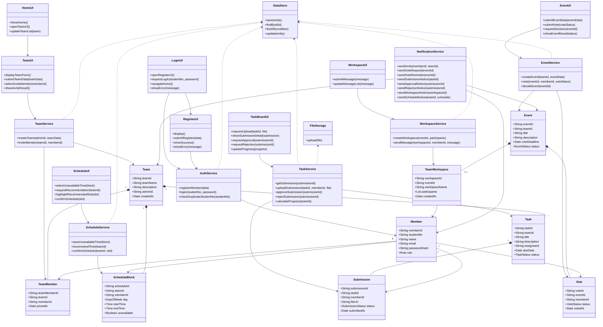

### 2.1 Class description

아래의 표는 위 Class Diagram에서 표현한 클래스들에 대한 설명이다.

| Class Name | Explanation |
| :--- | :--- |
| `LoginUI` | 사용자가 학번과 비밀번호를 입력하고 로그인 또는 회원가입을 선택하는 경계 클래스이다. |
| `RegisterUI` | 회원가입 정보를 입력받고 가입 성공 또는 오류 메시지를 표시하는 경계 클래스이다. |
| `HomeUI` | 로그인 후 팀 목록, 주요 알림, 기능 진입 메뉴를 표시하는 경계 클래스이다. |
| `TeamUI` | 팀 생성 정보 입력과 팀원 초대 선택을 처리하는 경계 클래스이다. |
| `ScheduleUI` | 불가능 시간 선택, 추천 시간 표시, 일정 확정 요청을 처리하는 경계 클래스이다. |
| `TaskBoardUI` | 과제 목록, 제출물 업로드, 제출물 확인, 승인/반려 요청을 처리하는 경계 클래스이다. |
| `EventUI` | 이벤트 생성, 이벤트 투표, 이벤트 확정 요청을 처리하는 경계 클래스이다. |
| `WorkspaceUI` | 참여자 전용 워크스페이스의 메시지 표시와 메시지 전송을 처리하는 경계 클래스이다. |
| `AuthService` | 회원가입, 로그인, 학번 중복 확인을 담당한다. 입력된 학번과 비밀번호를 회원 정보와 비교하여 시스템 접근 여부를 결정한다. |
| `Member` | 시스템을 사용하는 회원 또는 관리자의 정보를 저장하는 도메인 클래스이다. 학번, 이름, 이메일, 비밀번호 해시, 권한 정보를 가진다. |
| `TeamService` | 팀 생성과 팀원 초대를 담당한다. 관리자가 팀을 만들고 등록된 멤버를 초대하는 기능을 처리한다. |
| `Team` | 하나의 프로젝트 팀 또는 스터디 그룹을 표현한다. 팀명, 설명, 관리자 ID, 생성일을 가진다. |
| `TeamMember` | 회원과 팀의 다대다 관계를 표현하는 연결 클래스이다. 한 회원은 여러 팀에 속할 수 있고 한 팀은 여러 회원을 가질 수 있다. |
| `ScheduleService` | 멤버의 불가능 시간 블록을 저장하고, 팀원들의 시간을 비교하여 최적의 모임 시간을 추천한다. 관리자가 추천 시간을 확정할 때도 사용된다. |
| `ScheduleBlock` | 사용자가 캘린더에서 선택한 불가능 시간 정보를 표현한다. 요일, 시작 시간, 종료 시간, 팀 ID, 회원 ID를 가진다. |
| `TaskService` | 제출물 조회, 제출물 업로드, 제출물 승인/반려, 팀 진행률 계산을 담당한다. |
| `Task` | 팀별로 수행해야 하는 미션 또는 과제를 표현한다. 제목, 설명, 담당자, 마감일, 진행 상태를 가진다. |
| `Submission` | 멤버가 과제에 대해 업로드한 제출물을 표현한다. 제출 파일 경로, 제출자, 제출 상태, 제출 시간을 가진다. |
| `EventService` | 이벤트 생성, 참여/불참 투표, 이벤트 확정을 담당한다. |
| `Event` | 종강 파티, 친목 회식, 임시 모임처럼 참여 여부 확인이 필요한 이벤트를 표현한다. |
| `Vote` | 특정 이벤트에 대한 한 회원의 참여/불참/미응답 상태를 표현한다. |
| `WorkspaceService` | 이벤트 참여자로 확정된 회원만 포함하는 임시 워크스페이스를 생성하고 메시지를 처리한다. |
| `TeamWorkspace` | 이벤트 참여자 전용 소통 공간을 표현한다. 워크스페이스명, 이벤트 ID, 참여자 목록, 생성일을 가진다. |
| `NotificationService` | 팀 초대, 이벤트 투표 요청, 미투표자 리마인드, 과제 제출, 일정 확정 알림을 생성한다. |
| `DataStore` | 회원, 팀, 일정, 과제, 이벤트, 워크스페이스 데이터에 대한 저장과 조회를 담당한다. |
| `FileStorage` | 과제 제출물 파일의 업로드를 담당한다. |

---

## 3. Sequence diagram

아래에 나오는 그림들은 Conceptualization에서 표현한 주요 기능들을 Sequence Diagram으로 표현한 것이다. 각 기능은 사용자의 UI 조작, 서비스 클래스의 처리, 저장소 또는 알림 서비스와의 상호작용 순서로 설명한다.

### 3.1 Register member

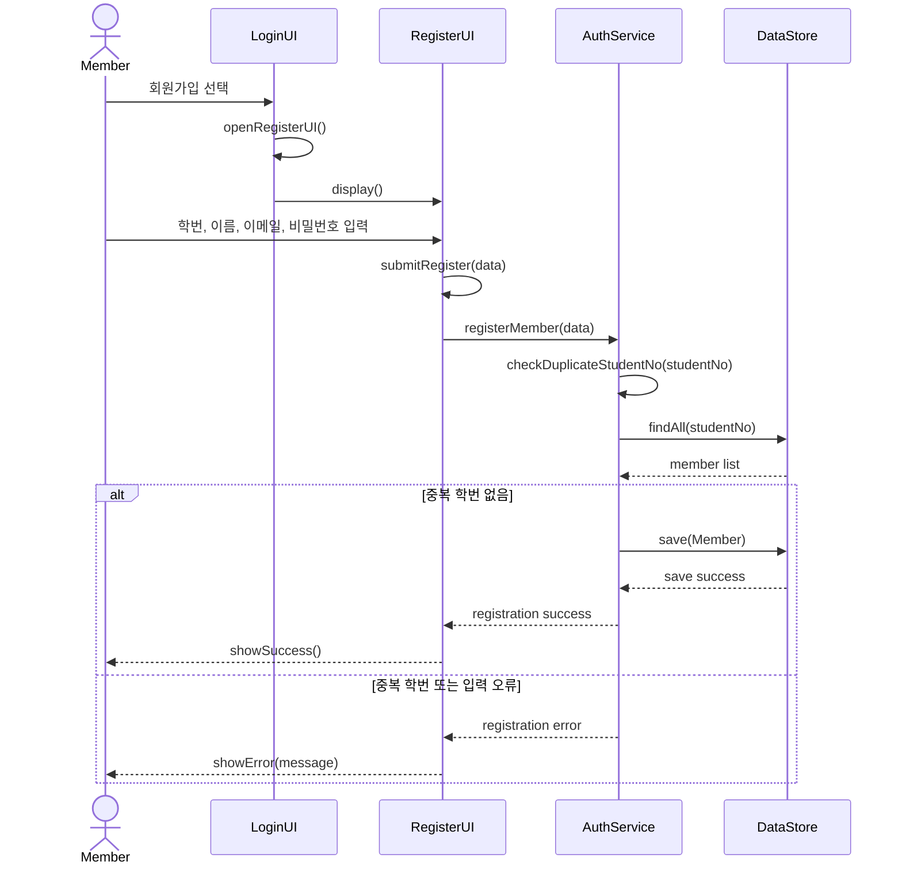

회원가입 기능은 사용자가 학번, 이름, 이메일, 비밀번호를 입력하면 `AuthService`가 학번 중복 여부와 입력값 유효성을 검사한 뒤 `Member` 정보를 저장하는 과정이다.

### 3.2 Login

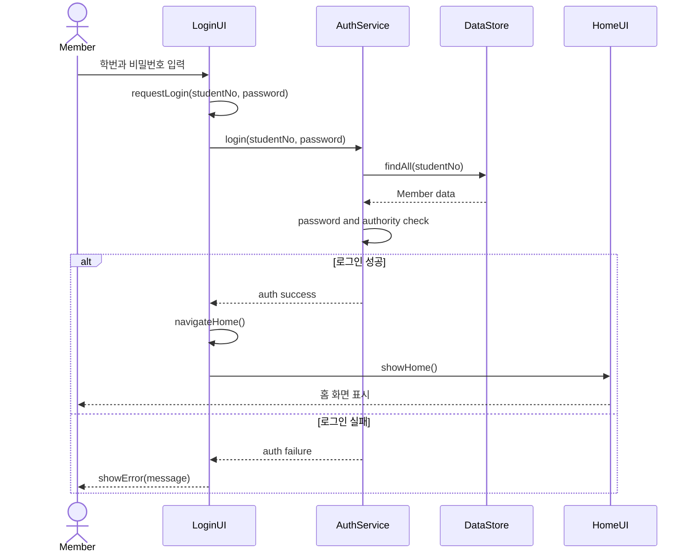

로그인 기능은 학번과 비밀번호를 검증한 뒤 성공하면 Home 화면으로 이동하는 과정이다. 검증에 실패하면 오류 메시지를 표시하고 다시 입력을 기다린다.

### 3.3 Create Team

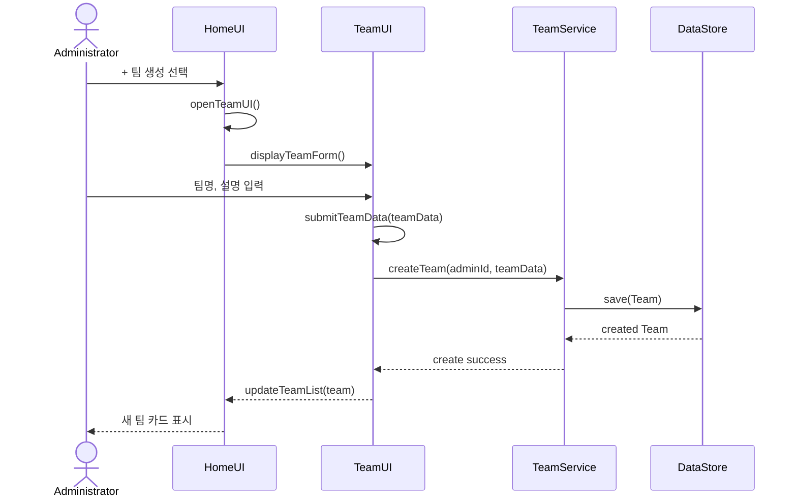

팀 생성 기능은 관리자가 새로운 프로젝트 또는 스터디 그룹을 만들 때 사용한다. 팀이 생성되면 팀 목록에 새 팀이 추가되고 이후 멤버 초대, 일정 조율, 과제 관리의 기준 단위가 된다.

### 3.4 Invite Member

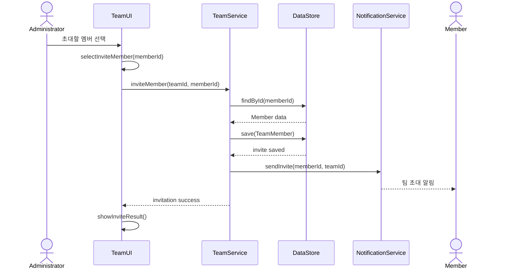

팀원 초대 기능은 생성된 팀에 기존 회원을 참여시키는 기능이다. 초대가 완료되면 `TeamMember`가 생성되고 초대 대상자에게 알림이 전달된다.

### 3.5 Input Schedule

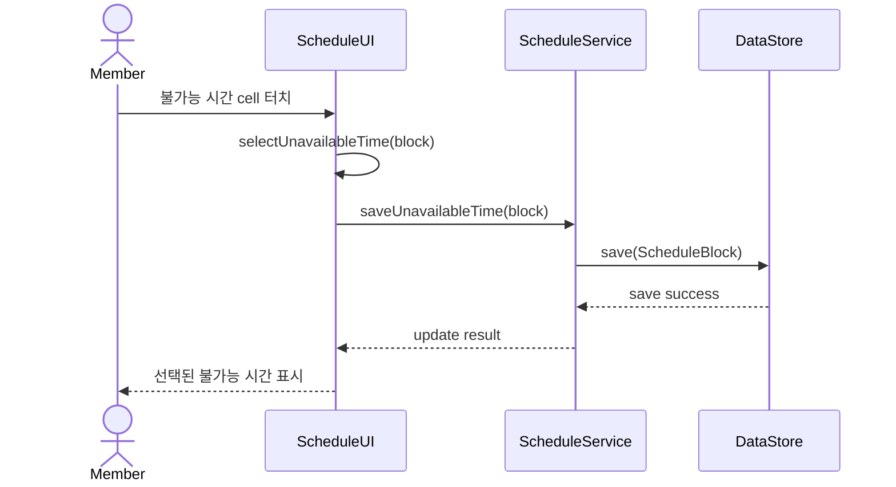

일정 입력 기능은 사용자가 텍스트로 시간을 입력하는 대신 캘린더 cell을 선택하여 참석 불가능 시간을 표시하는 방식이다. 저장된 불가능 시간은 이후 일정 추천에 사용된다.

### 3.6 Decide Schedule

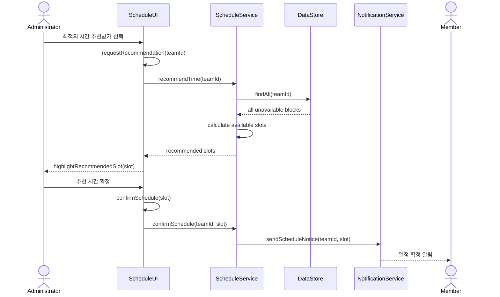

일정 확정 기능은 팀원들의 불가능 시간 교집합을 바탕으로 전원 참석 가능 시간 또는 최대 참석 가능 시간을 추천한다. 관리자가 추천 시간 중 하나를 확정하면 팀원들에게 일정 확정 알림을 전달한다.

### 3.7 Upload Task

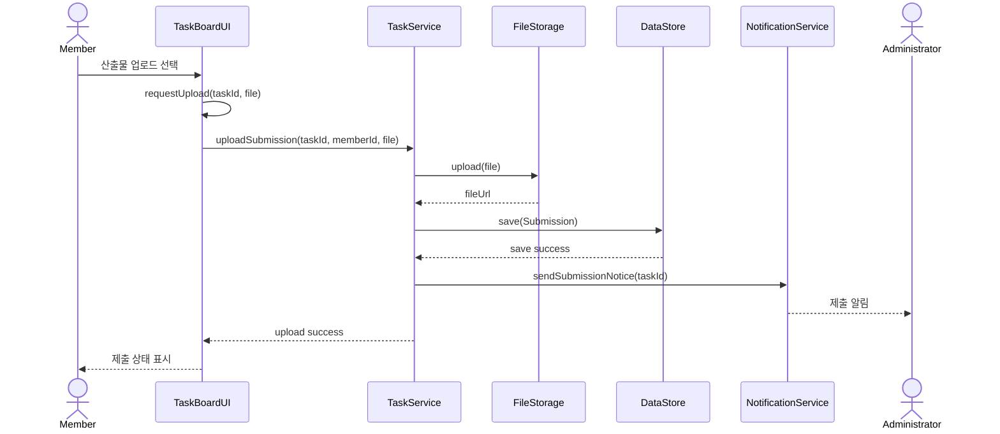

과제 업로드 기능은 멤버가 담당 과제의 산출물을 제출하는 기능이다. 제출이 완료되면 제출 상태가 갱신되고 관리자에게 제출 알림이 전달된다.

### 3.8 Approve Task

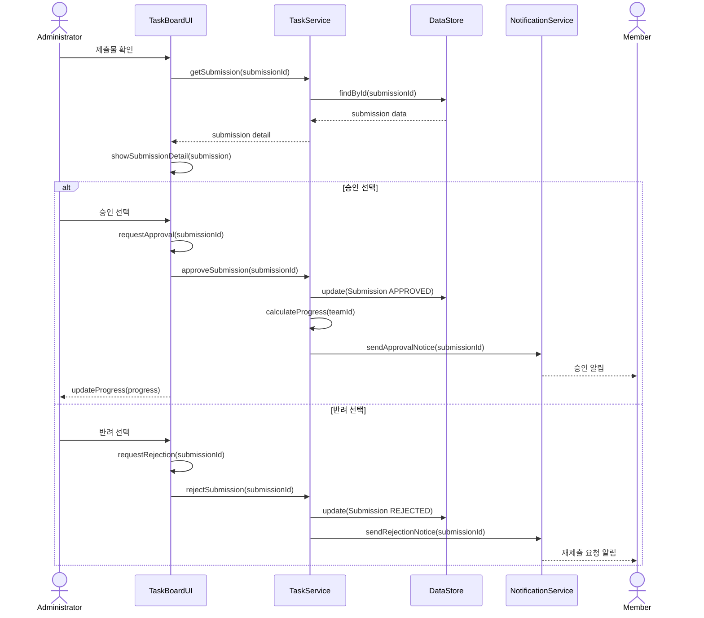

과제 승인 기능은 관리자가 제출된 산출물을 검토하고 승인 또는 반려하는 기능이다. 승인된 제출물은 팀 진행률에 반영되고, 반려된 제출물은 재제출 대상으로 표시된다.

### 3.9 Manage Event & Notification

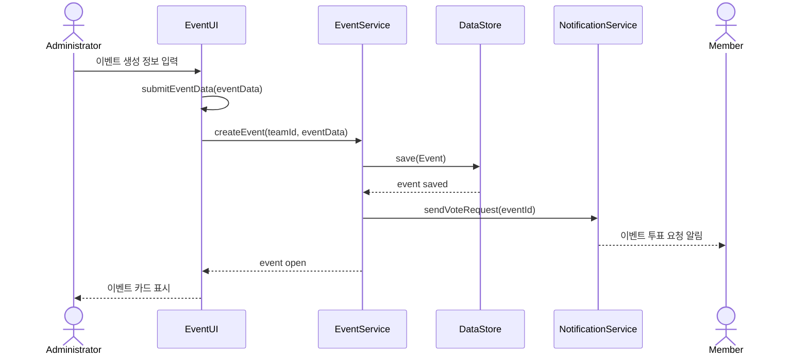

이벤트 및 알림 관리 기능은 관리자가 이벤트를 생성하고 멤버에게 참여 여부 투표를 요청하는 과정이다. 이벤트가 생성되면 대상 멤버에게 투표 요청 알림이 전달된다.

### 3.10 Vote Event

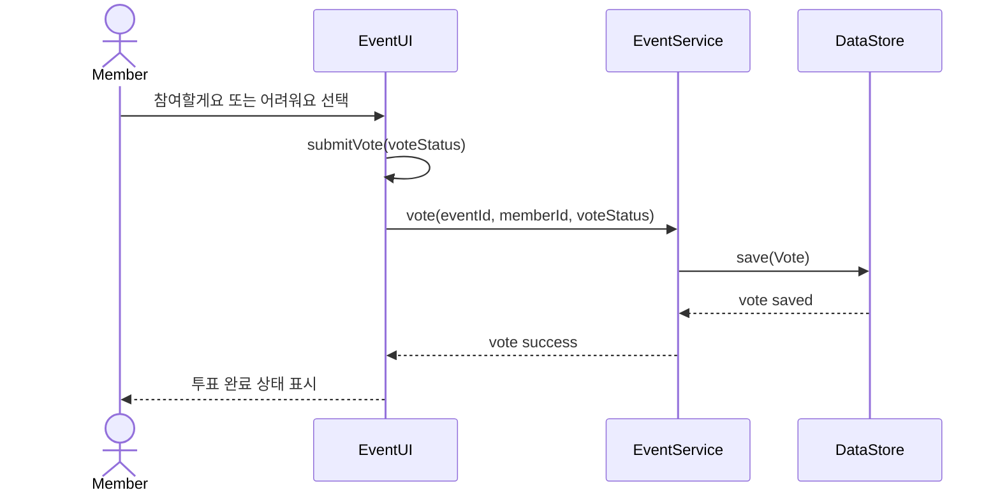

이벤트 투표 기능은 사용자가 특정 이벤트에 대해 참여 또는 불참 의사를 제출하는 기능이다. 투표 결과는 이벤트 확정과 워크스페이스 생성 여부를 결정하는 기준이 된다.

### 3.11 Alert Vote

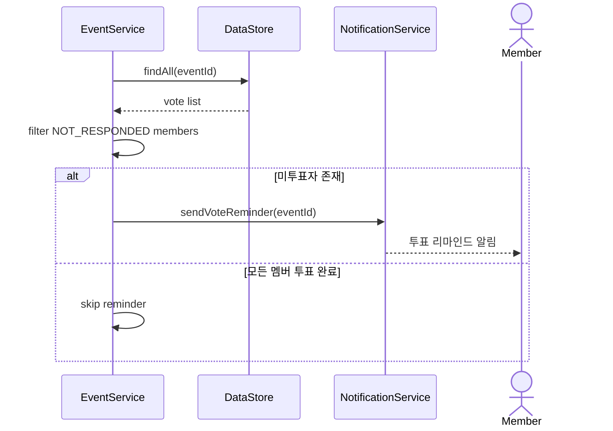

투표 알림 기능은 이벤트 마감 전 미투표자를 찾아 리마인드 알림을 보내는 기능이다. 모든 멤버가 투표를 완료한 경우 리마인드 알림은 생략된다.

### 3.12 Decide Event

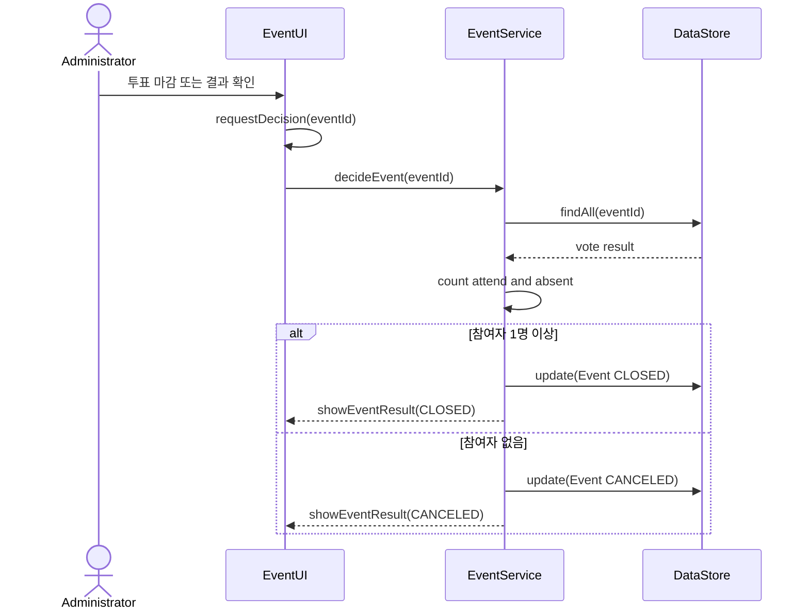

이벤트 확정 기능은 참여/불참 투표 결과를 바탕으로 이벤트 진행 여부를 결정한다. 참여자가 없으면 이벤트를 취소하고, 참여자가 있으면 워크스페이스 생성 단계로 넘어간다.

### 3.13 Create Team Workspace

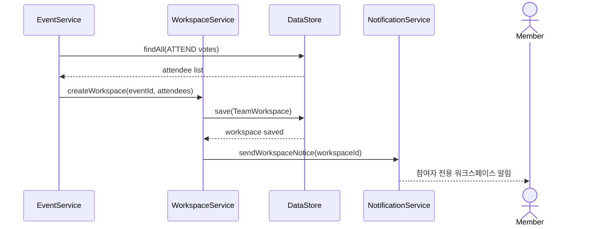

팀 워크스페이스 생성 기능은 이벤트 참여자로 확정된 멤버만 포함하는 임시 소통 공간을 자동으로 만드는 기능이다. 참여자가 없으면 워크스페이스를 생성하지 않는다.

### 3.14 Manage Team Workspace

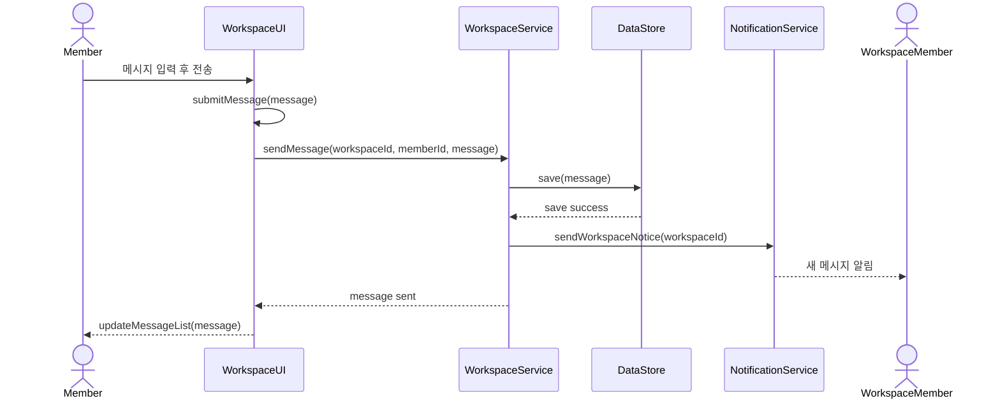

팀 워크스페이스 관리 기능은 참여자 전용 채팅/공지 공간에서 메시지를 주고받는 기능이다. 해당 워크스페이스에 포함된 멤버만 메시지를 확인하고 작성할 수 있다.

---

## 4. State machine diagram

아래의 그림은 Jo:YUl 시스템의 전체 상태 흐름을 표현한 State Machine Diagram이다. 사용자는 시스템 실행 후 회원가입 또는 로그인을 거쳐 Home에 진입하며, Home에서 일정, 과제, 이벤트, 워크스페이스 기능으로 이동한다.

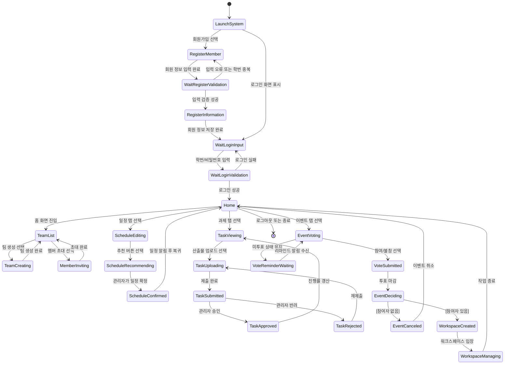

### 4.1 State description

아래의 표는 위 State Machine Diagram에 나온 각 State에 대한 설명이다.

| State | Explanation |
| :--- | :--- |
| `LaunchSystem` | 사용자가 Jo:YUl 시스템을 실행한 초기 상태이다. |
| `RegisterMember` | 사용자가 회원가입 정보를 입력하는 상태이다. 학번, 이름, 이메일, 비밀번호를 입력한다. |
| `WaitRegisterValidation` | 회원가입 입력값 검증 결과를 기다리는 상태이다. 학번 중복, 비밀번호 일치 여부, 필수값 누락을 검사한다. |
| `RegisterInformation` | 검증이 끝난 회원 정보를 저장하는 상태이다. 실제 서비스에서는 `Member` 데이터가 DB에 저장된다. |
| `WaitLoginInput` | 로그인하기 위해 학번과 비밀번호 입력을 기다리는 상태이다. |
| `WaitLoginValidation` | 입력한 학번과 비밀번호가 등록된 회원 정보와 일치하는지 확인하는 상태이다. |
| `Home` | 로그인 성공 후 시스템 내부에 진입한 상태이다. 팀 목록, 알림, 이벤트 투표 카드가 표시된다. |
| `TeamList` | 사용자가 참여 중인 팀 목록과 각 팀의 진행률을 확인하는 상태이다. |
| `TeamCreating` | 관리자가 새 팀을 생성하는 상태이다. |
| `MemberInviting` | 관리자가 팀에 멤버를 초대하는 상태이다. 초대가 완료되면 팀 멤버 목록이 갱신된다. |
| `ScheduleEditing` | 사용자가 일정 탭에서 참석 불가능한 시간을 선택하는 상태이다. |
| `ScheduleRecommending` | 시스템이 팀원들의 불가능 시간 블록을 비교하여 최적 시간을 계산하는 상태이다. |
| `ScheduleConfirmed` | 관리자가 추천 시간을 최종 모임 시간으로 확정한 상태이다. |
| `TaskViewing` | 과제 탭에서 팀 진행률과 과제별 제출 상태를 확인하는 상태이다. |
| `TaskUploading` | 멤버가 과제 산출물을 업로드하는 상태이다. |
| `TaskSubmitted` | 제출물이 저장되고 관리자 확인을 기다리는 상태이다. |
| `TaskApproved` | 관리자가 제출물을 승인하여 과제 진행률이 갱신된 상태이다. |
| `TaskRejected` | 관리자가 제출물을 반려하여 멤버가 재제출해야 하는 상태이다. |
| `EventVoting` | 사용자가 이벤트 탭에서 참여 또는 불참을 선택하는 상태이다. |
| `VoteReminderWaiting` | 아직 투표하지 않은 사용자가 리마인드 알림을 기다리는 상태이다. |
| `VoteSubmitted` | 사용자가 이벤트 참여/불참 투표를 완료한 상태이다. |
| `EventDeciding` | 투표 마감 후 참여자 수를 기준으로 이벤트 진행 여부를 결정하는 상태이다. |
| `EventCanceled` | 참여자가 없거나 조건을 만족하지 못해 이벤트가 취소된 상태이다. |
| `WorkspaceCreated` | 참여자만 포함한 임시 워크스페이스가 생성된 상태이다. |
| `WorkspaceManaging` | 참여자 전용 워크스페이스에서 메시지와 공지를 주고받는 상태이다. |

---

## 5. Implementation requirements

Jo:YUl 시스템을 구동하고 향후 실제 서비스로 확장하기 위해 필요한 요구사항은 아래와 같다.

### 5.1 Hardware requirements

| Item | Requirement |
| :--- | :--- |
| Client Device | Chrome, Edge, Safari 등 최신 브라우저를 실행할 수 있는 PC 또는 모바일 기기 |
| RAM | 4GB 이상 권장 |
| Storage | 서비스 실행 및 파일 저장을 위한 충분한 저장 공간 |
| Network | 클라이언트와 서버 간 통신을 위한 인터넷 연결 |

### 5.2 Software requirements

| Item | Requirement |
| :--- | :--- |
| Operating System | Windows 10 이상 또는 macOS/Linux |
| Runtime | Node.js |
| Frontend | Web or mobile application |
| Backend | API server |
| API Style | REST API 또는 equivalent API |
| Database | Relational database 또는 document database |

### 5.3 Nonfunctional requirements

| Requirement | Description |
| :--- | :--- |
| Usability | 모바일 화면에서 한 손으로 일정 선택, 투표, 업로드 상태 확인을 할 수 있어야 한다. |
| Performance | 로그인, 화면 전환, 추천 결과 표시가 3초 이내에 이루어져야 한다. |
| Reliability | 실제 서비스에서는 일정, 투표, 제출 데이터가 새로고침 후에도 유지되어야 한다. |
| Security | 실제 서비스에서는 비밀번호를 해시로 저장하고 관리자 기능 접근을 권한으로 제한해야 한다. |
| Maintainability | UI 컴포넌트, 서비스 로직, 데이터 접근 로직을 분리하여 기능 추가가 쉽도록 한다. |
| Scalability | 팀, 멤버, 이벤트, 제출물이 증가해도 조회와 알림 처리가 가능하도록 서버 구조를 분리한다. |

### 5.4 Service assumptions

| Assumption | Description |
| :--- | :--- |
| Authentication | 회원은 학번과 비밀번호로 로그인하며, 관리자는 별도 권한을 가진다. |
| Persistence | 회원, 팀, 일정, 과제, 투표, 워크스페이스 데이터는 저장소에 유지된다. |
| File Upload | 과제 제출물은 파일 저장소에 업로드되고 제출 기록과 연결된다. |
| Notification | 주요 이벤트 발생 시 대상 사용자에게 알림을 전달한다. |
| Admin Role | 팀 생성, 멤버 초대, 일정 확정, 과제 승인, 이벤트 생성은 관리자 권한으로 제한한다. |

---

## 6. Glossary

| Terms | Description |
| :--- | :--- |
| `Class Diagram` | 객체지향 시스템에서 클래스, 속성, 메소드, 클래스 간 관계를 표현하는 다이어그램이다. |
| `Sequence Diagram` | 특정 기능이 수행될 때 객체 또는 컴포넌트들이 어떤 순서로 메시지를 주고받는지 표현하는 다이어그램이다. |
| `State Machine Diagram` | 시스템 또는 객체가 가질 수 있는 상태와 상태 전이를 표현하는 다이어그램이다. |
| `Member` | Jo:YUl을 사용하는 일반 회원이다. 일정 입력, 과제 업로드, 이벤트 투표를 수행한다. |
| `Administrator` | 팀 생성, 팀원 초대, 일정 확정, 과제 승인, 이벤트 생성을 수행하는 사용자이다. |
| `Team` | 프로젝트 팀, 스터디, 모임을 나타내는 단위이다. |
| `ScheduleBlock` | 사용자가 참석할 수 없는 시간을 캘린더에 블록으로 표시한 데이터이다. |
| `Task` | 팀 내에서 수행해야 하는 과제 또는 미션이다. |
| `Submission` | 멤버가 과제에 대해 제출한 산출물 데이터이다. |
| `Event` | 참여/불참 투표가 필요한 회식, 친목 모임, 임시 모임 등의 일정이다. |
| `Vote` | 이벤트에 대한 멤버의 참여, 불참, 미응답 상태이다. |
| `TeamWorkspace` | 이벤트 참여자로 확정된 멤버만 사용하는 임시 소통 공간이다. |
| `Notification` | 투표 요청, 일정 확정, 제출 알림 등 사용자에게 전달되는 시스템 메시지이다. |

---

## 7. References

1. [순천향대 신문, '카카오톡 공지방의 길고 반복되는 메시지, 정보 피로만 높인다', 2025-10](http://news.sch.ac.kr/news/articleView.html?idxno=1462)
2. [알바몬, '강의실 최악의 꼴불견' 설문조사 (뉴시스 보도), 2017-05](https://mobile.newsis.com/view/NISX20170526_0014921368)
3. [대학내일20대연구소, '대학생 팀플 실태 조사', 2018](https://www.20slab.org/Archives/29118)
