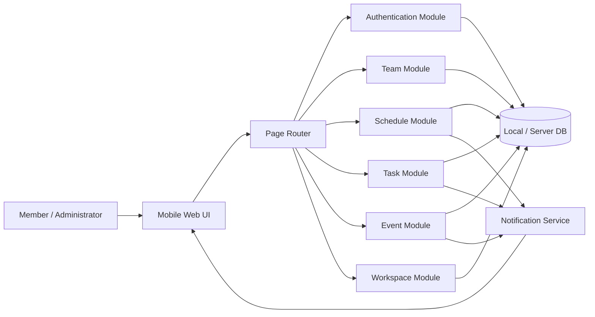
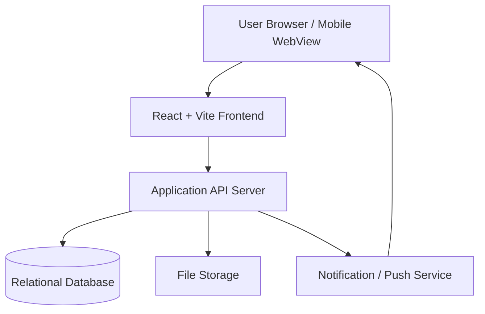
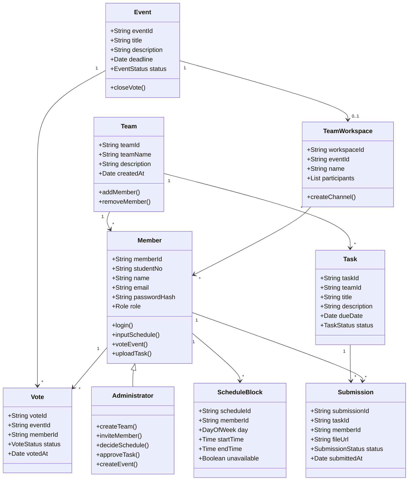
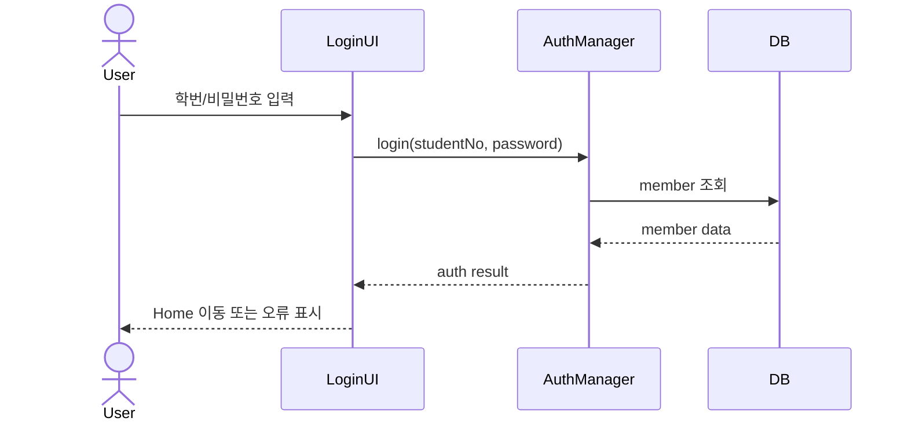
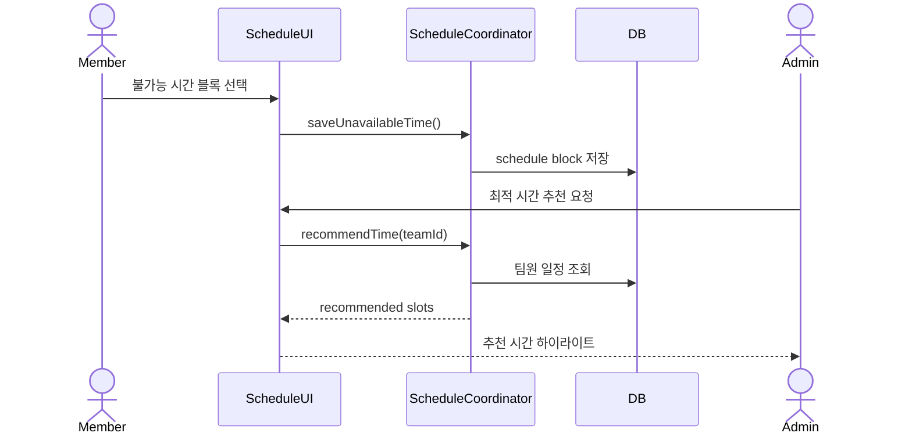
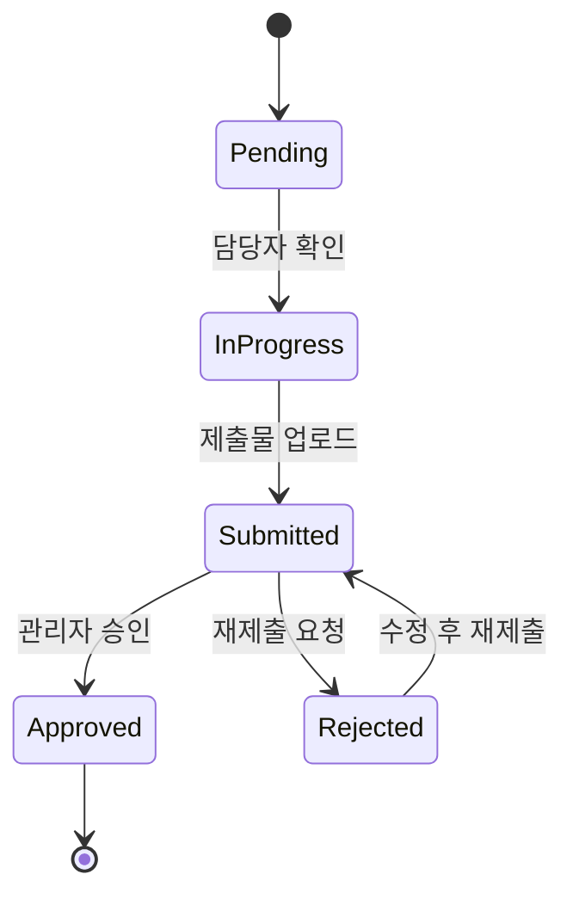
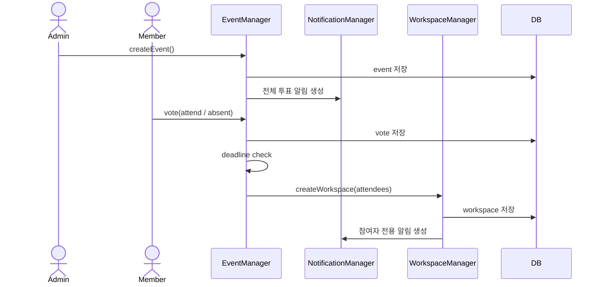
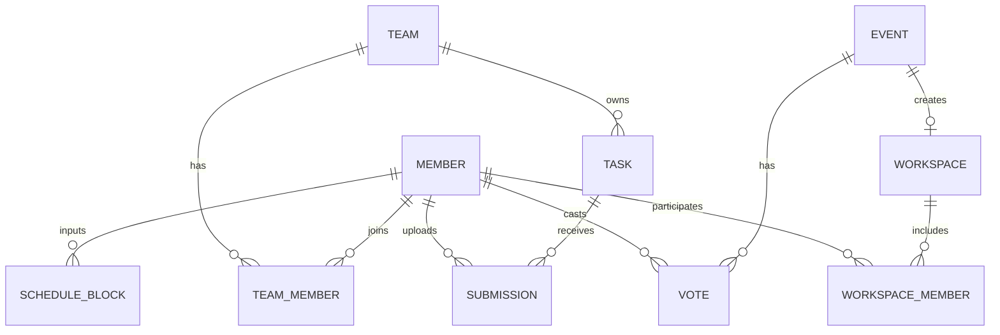
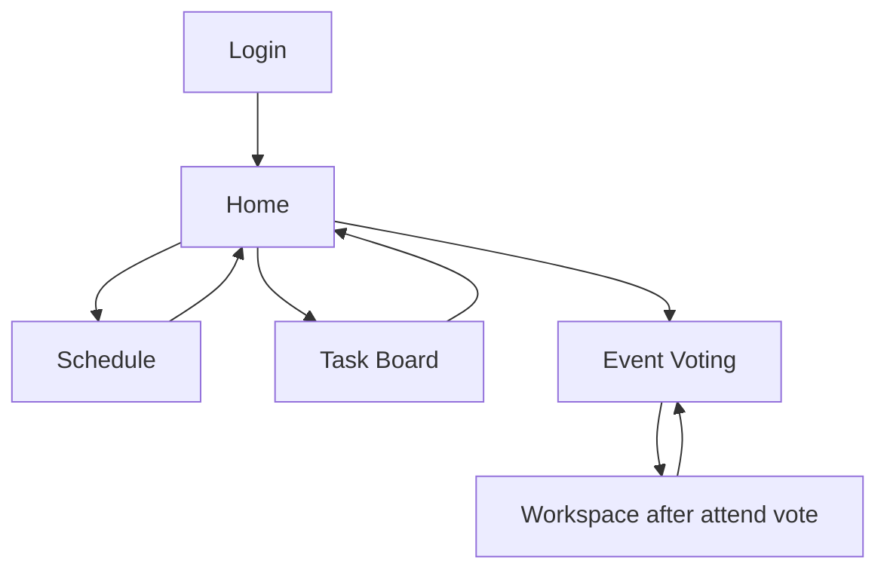

# [Design] Jo:YUl (종합 모임 관리 및 조율 시스템)

| Student No | Name | E-Mail |
| :--- | :--- | :--- |
| 22411923 | 홍주은 | goldong23@yu.ac.kr |

## [ Revision history ]

| Revision date | Version # | Description | Author |
| :--- | :--- | :--- | :--- |
| 2026-05-29 | 1.00 | First draft (Jo:YUl design document) | 홍주은 |

## = Contents =

1. Introduction
2. System Architecture Design
3. Detailed Design
4. Data Design
5. User Interface Design
6. Requirements Traceability
7. Non-functional Design
8. References

---

## 1. Introduction

### 1.1 Purpose

본 문서는 종합 모임 관리 및 조율 시스템 **Jo:YUl(조율)**의 설계 내용을 정의한다. Jo:YUl은 대학생 팀 프로젝트와 소규모 모임에서 반복적으로 발생하는 일정 조율, 공지 전달, 과제 제출, 참여 인원 분리 문제를 하나의 모바일 중심 시스템에서 해결하는 것을 목표로 한다.

개념화 문서와 분석 문서에서 정의한 주요 유스케이스를 바탕으로, 본 설계 문서는 다음 내용을 구체화한다.

- 시스템을 구성하는 주요 컴포넌트와 책임
- 유스케이스별 처리 흐름과 모듈 간 상호작용
- 데이터 모델과 저장 구조
- 사용자 화면 구성 및 화면 전환 흐름
- 분석 단계 요구사항과 설계 요소 간 추적 관계

### 1.2 Scope

Jo:YUl의 초기 프로토타입은 React + Vite 기반 모바일 웹 화면으로 구현되어 있으며, 실제 서버와 데이터베이스 없이 화면 흐름과 핵심 인터랙션을 검증하는 것을 범위로 한다.

| Scope Item | Prototype Status | Description |
| :--- | :--- | :--- |
| Member Authentication | Implemented as UI flow | 학번과 비밀번호를 입력하면 Home 화면으로 이동한다. 실제 인증 검증은 추후 서버 연동 대상이다. |
| Team Management | Partially implemented | Home 화면에서 팀 목록, 멤버 수, 다음 모임, 진행률을 표시한다. 팀 생성 버튼은 표시되지만 별도 생성 화면은 아직 구현하지 않는다. |
| Schedule Coordination | Implemented as interactive mock | 월~금, 09:00~17:00 캘린더에서 불가능 시간을 선택하고 추천 버튼을 눌러 추천 시간을 하이라이트한다. |
| Task Management | Implemented as interactive mock | 팀 진행률, 과제 카드, 담당자, 상태 배지, 제출물 업로드 버튼을 표시한다. 업로드 버튼 클릭 시 mock 상태가 완료로 변경된다. |
| Event Voting | Implemented as interactive mock | 이벤트 카드에서 참여/불참 투표를 수행한다. 참여 투표 후 워크스페이스 생성 상태로 전환된다. |
| Team Workspace | Implemented after vote | 참여 투표 후 참여자 전용 그룹 화면과 메시지 입력 영역을 표시한다. |
| Notification | UI only | Home의 알림 아이콘과 이벤트 투표 카드로 알림 상태를 표현한다. 실제 push 또는 SMTP 연동은 제외한다. |

### 1.3 Prototype Review Result

실제 프로토타입 실행 결과, 화면은 최대 480px 폭의 모바일 프레임 안에서 다크 네이비 배경, 보라색 그라디언트, 반투명 glass panel/card를 중심으로 구성되어 있다. 로그인 이후에는 화면 하단에 `홈`, `일정`, `과제`, `이벤트` 탭이 고정되어 있고, 각 탭은 독립된 주요 작업 하나를 수행하도록 설계되어 있다.

| Screen | Observed Prototype Design |
| :--- | :--- |
| Login | 중앙 정렬된 Jo:YUl 로고, 학번/비밀번호 입력창, 지문 아이콘이 포함된 `시작하기` 버튼으로 구성된다. |
| Home | 사용자 환영 문구, 알림 아이콘, 새 이벤트 투표 카드, 세 개의 팀 카드와 진행률 막대를 표시한다. |
| Schedule | 안내 패널, 5일 x 9시간 캘린더 그리드, `최적의 시간 추천받기` 버튼으로 구성된다. |
| Task | 팀 전체 진행률 패널과 세 개의 과제 카드가 있으며, 완료 과제는 파일명과 체크 아이콘을 표시한다. |
| Event | D-3 투표 마감 이벤트 카드와 `참여할게요`, `어려워요` 투표 버튼을 제공한다. |

### 1.4 Design Goals

Jo:YUl의 설계 목표는 다음과 같다.

1. 사용자가 별도의 외부 메신저를 오가지 않고 팀 운영에 필요한 정보를 한 화면 흐름 안에서 확인할 수 있어야 한다.
2. 일정 조율은 사용자가 가능한 시간을 직접 나열하는 방식이 아니라, 불가능 시간을 블록으로 입력하고 시스템이 가능한 시간을 계산하는 방식으로 설계한다.
3. 이벤트 참여 여부에 따라 불필요한 전체 공지를 줄이고, 참여자 중심의 워크스페이스를 자동으로 구성한다.
4. 과제와 제출물 상태를 팀 단위로 가시화하여 무임승차 문제를 줄이고 진행 상황을 투명하게 관리한다.
5. 초기 프로토타입은 모바일 앱 형태의 사용자 경험을 우선하며, 실제 서버 연동 전에도 핵심 흐름을 검증할 수 있도록 프론트엔드 중심으로 구현한다.

---

## 2. System Architecture Design

### 2.1 Overall Architecture

Jo:YUl은 모바일 웹 프로토타입을 기준으로 한 클라이언트 중심 구조로 설계한다. 향후 확장을 고려하여 UI Layer, Application Logic Layer, Data Access Layer, Notification Service를 분리한다.

### 2.2 Layered Structure

| Layer | Responsibility | Current Prototype |
| :--- | :--- | :--- |
| Presentation Layer | 화면 렌더링, 사용자 입력 수집, 페이지 이동 | `Login`, `Home`, `Schedule`, `TaskBoard`, `Event`, `Layout` |
| Application Layer | 로그인 화면 이동, 일정 추천 상태 전환, 과제 업로드 상태 전환, 이벤트 투표 상태 전환 | 각 page component 내부의 `useState`와 handler 함수 |
| Domain Layer | Member, Team, Schedule, Task, Event, Workspace 규칙 정의 | mock team/task/event data와 문서 설계 |
| Data Layer | 회원, 팀, 일정, 제출물, 투표 데이터 저장 | 현재는 컴포넌트 내부 mock data이며 새로고침 시 유지되지 않음 |
| Notification Layer | 미응답 투표, 제출, 일정 확정 알림 생성 | Home 알림 아이콘과 이벤트 카드로 화면상 표현 |

### 2.3 Main Components

| Component | Main Responsibility | Current Prototype Mapping |
| :--- | :--- | :--- |
| AuthManager | 회원가입, 로그인, 권한 확인 | `Login.jsx`의 입력 form과 `/home` 이동으로 표현 |
| TeamManager | 팀 생성, 팀원 초대, 팀 목록 관리 | `Home.jsx`의 팀 카드 목록과 `+ 팀 생성` 표시로 표현 |
| ScheduleCoordinator | 불가능 시간 저장, 교집합 계산, 추천 시간 제시 | `Schedule.jsx`의 선택 cell set과 추천 하이라이트 상태로 표현 |
| TaskManager | 미션 등록, 제출물 업로드, 승인 상태 관리 | `TaskBoard.jsx`의 task mock data와 upload handler로 표현 |
| EventManager | 이벤트 생성, 참여 투표, 투표 마감 처리 | `Event.jsx`의 참여/불참 버튼과 voted 상태로 표현 |
| WorkspaceManager | 이벤트 참여자 기준 임시 워크스페이스 생성 | `Event.jsx`에서 참여 투표 후 workspace panel로 전환 |
| NotificationManager | 알림 생성, 미응답자 대상 리마인드 | 실제 전송 없이 Home의 알림 dot과 투표 카드로 표현 |

### 2.4 Deployment View

초기 프로토타입은 Vite 기반 React 앱으로 실행된다. 실제 서비스 단계에서는 API 서버와 데이터베이스 서버를 분리한다.

---

## 3. Detailed Design

### 3.1 Class Diagram

### 3.2 Use Case Realization

#### 3.2.1 Register & Login

| Item | Design |
| :--- | :--- |
| Input | studentNo, name, email, password |
| Process | 학번 중복 확인 후 회원 정보를 저장하고, 로그인 시 입력값을 기존 회원 정보와 비교한다. |
| Output | 인증 성공 시 Home 화면으로 이동한다. 실패 시 오류 메시지를 제공한다. |
| Exception | 미가입 학번, 비밀번호 불일치, 네트워크 연결 실패 |

#### 3.2.2 Team Creation & Invitation

| Item | Design |
| :--- | :--- |
| Input | teamName, description, selectedMembers |
| Process | 관리자가 팀을 생성하고 등록된 회원 목록에서 팀원을 초대한다. |
| Output | 팀 목록에 새 팀이 추가되고 초대 대상자에게 알림을 생성한다. |
| Exception | 이미 존재하는 팀 이름, 존재하지 않는 회원, 초대 권한 없음 |

#### 3.2.3 Schedule Coordination

| Item | Design |
| :--- | :--- |
| Input | memberId, day, startTime, endTime, unavailable flag |
| Process | 팀원별 불가능 시간 블록을 저장하고 시간대별 참석 가능 인원을 계산한다. |
| Output | 전원 참석 가능 시간 또는 최대 참석 가능 시간 추천 |
| Exception | 모든 팀원이 불가능한 시간만 존재하는 경우 차선 시간 추천 |

일정 추천 알고리즘은 다음 절차를 따른다.

1. 팀에 속한 모든 멤버의 불가능 시간 블록을 수집한다.
2. 시스템 기준 시간표를 1시간 또는 30분 단위 슬롯으로 분할한다.
3. 각 슬롯마다 불가능한 멤버 수를 계산한다.
4. 불가능한 멤버 수가 0인 슬롯을 우선 추천한다.
5. 전원 참석 가능 시간이 없으면 참석 가능 인원이 가장 많은 슬롯을 차선 추천한다.

#### 3.2.4 Task Upload & Approval

| Item | Design |
| :--- | :--- |
| Input | taskId, memberId, text, attachedFile |
| Process | 멤버가 제출물을 업로드하면 관리자에게 제출 알림을 생성한다. 관리자는 제출물을 검토한 뒤 승인 또는 재제출 요청을 선택한다. |
| Output | 제출 상태와 팀 진행률이 갱신된다. |
| Exception | 허용되지 않은 파일 형식, 파일 크기 초과, 마감일 이후 제출 |

#### 3.2.5 Event Voting & Workspace Creation

| Item | Design |
| :--- | :--- |
| Input | event title, description, deadline, vote result |
| Process | 관리자가 이벤트를 생성하면 멤버가 참여/불참을 투표한다. 마감 후 참여자만 포함한 워크스페이스를 자동 생성한다. |
| Output | 참여자 전용 워크스페이스와 알림 채널 생성 |
| Exception | 참여자가 0명인 경우 워크스페이스를 생성하지 않고 이벤트를 취소 처리 |

---

## 4. Data Design

### 4.1 Entity Relationship

### 4.2 Table Design

#### MEMBER

| Column | Type | Key | Description |
| :--- | :--- | :--- | :--- |
| member_id | varchar | PK | 회원 고유 ID |
| student_no | varchar | UK | 학번 |
| name | varchar |  | 이름 |
| email | varchar |  | 이메일 |
| password_hash | varchar |  | 암호화된 비밀번호 |
| role | enum |  | MEMBER, ADMIN |
| created_at | datetime |  | 가입 일시 |

#### TEAM

| Column | Type | Key | Description |
| :--- | :--- | :--- | :--- |
| team_id | varchar | PK | 팀 고유 ID |
| team_name | varchar |  | 팀명 |
| description | text |  | 팀 설명 |
| admin_id | varchar | FK | 팀 관리자 |
| created_at | datetime |  | 생성 일시 |

#### TEAM_MEMBER

| Column | Type | Key | Description |
| :--- | :--- | :--- | :--- |
| team_member_id | varchar | PK | 팀-회원 관계 ID |
| team_id | varchar | FK | 팀 ID |
| member_id | varchar | FK | 회원 ID |
| joined_at | datetime |  | 참여 일시 |

#### SCHEDULE_BLOCK

| Column | Type | Key | Description |
| :--- | :--- | :--- | :--- |
| schedule_id | varchar | PK | 일정 블록 ID |
| team_id | varchar | FK | 팀 ID |
| member_id | varchar | FK | 회원 ID |
| day_of_week | varchar |  | 요일 |
| start_time | time |  | 시작 시간 |
| end_time | time |  | 종료 시간 |
| unavailable | boolean |  | 불가능 시간 여부 |

#### TASK

| Column | Type | Key | Description |
| :--- | :--- | :--- | :--- |
| task_id | varchar | PK | 과제 ID |
| team_id | varchar | FK | 팀 ID |
| title | varchar |  | 과제 제목 |
| description | text |  | 과제 설명 |
| due_date | datetime |  | 마감일 |
| status | enum |  | PENDING, IN_PROGRESS, COMPLETED |

#### SUBMISSION

| Column | Type | Key | Description |
| :--- | :--- | :--- | :--- |
| submission_id | varchar | PK | 제출 ID |
| task_id | varchar | FK | 과제 ID |
| member_id | varchar | FK | 제출자 ID |
| content | text |  | 제출 설명 |
| file_url | varchar |  | 첨부 파일 경로 |
| status | enum |  | SUBMITTED, APPROVED, REJECTED |
| submitted_at | datetime |  | 제출 일시 |

#### EVENT

| Column | Type | Key | Description |
| :--- | :--- | :--- | :--- |
| event_id | varchar | PK | 이벤트 ID |
| team_id | varchar | FK | 관련 팀 ID |
| title | varchar |  | 이벤트 제목 |
| description | text |  | 이벤트 설명 |
| vote_deadline | datetime |  | 투표 마감 |
| status | enum |  | OPEN, CLOSED, CANCELED |

#### VOTE

| Column | Type | Key | Description |
| :--- | :--- | :--- | :--- |
| vote_id | varchar | PK | 투표 ID |
| event_id | varchar | FK | 이벤트 ID |
| member_id | varchar | FK | 투표자 ID |
| vote_status | enum |  | ATTEND, ABSENT, NOT_RESPONDED |
| voted_at | datetime |  | 투표 일시 |

#### WORKSPACE

| Column | Type | Key | Description |
| :--- | :--- | :--- | :--- |
| workspace_id | varchar | PK | 워크스페이스 ID |
| event_id | varchar | FK | 이벤트 ID |
| workspace_name | varchar |  | 워크스페이스 이름 |
| created_at | datetime |  | 생성 일시 |

### 4.3 Data Constraints

| Constraint | Description |
| :--- | :--- |
| Unique Student Number | 하나의 학번은 하나의 회원 계정에만 연결된다. |
| Team Admin Constraint | 팀 생성자는 기본 관리자 권한을 가진다. |
| Schedule Slot Constraint | 동일 멤버가 동일 시간대에 중복 블록을 저장할 수 없다. |
| Submission File Constraint | 현재 프로토타입은 실제 파일 선택 없이 mock 파일명으로 제출 상태를 표현한다. 실제 서비스에서는 문서, 이미지, 압축 파일 중심의 소용량 파일만 허용한다. |
| Workspace Creation Constraint | 이벤트 참여자가 1명 이상일 때만 워크스페이스를 생성한다. |

---

## 5. User Interface Design

### 5.1 UI Design Principles

Jo:YUl은 모바일 사용 상황을 우선으로 설계한다. 실제 프로토타입은 480px 폭의 모바일 프레임을 중심으로 하며, 사용자가 이동 중에도 빠르게 일정 입력, 투표, 제출 확인을 할 수 있도록 하단 탭 내비게이션과 카드형 정보 구조를 사용한다.

| Principle | Design Application |
| :--- | :--- |
| Mobile First | `#root`를 최대 480px로 제한해 모바일 앱처럼 보이게 구성한다. |
| Visual Identity | 다크 네이비 배경, 보라색 그라디언트 CTA, 반투명 glass panel/card를 일관되게 사용한다. |
| Fast Recognition | 홈, 일정, 과제, 이벤트를 하단 탭으로 분리하여 접근 경로를 단순화한다. |
| Status Visibility | 팀 진행률, 과제 완료 체크, 상태 배지, 알림 dot을 색상과 아이콘으로 표시한다. |
| Low Input Burden | 일정은 텍스트 입력 대신 캘린더 블록 터치 방식으로 입력한다. |
| Targeted Communication | 이벤트 참여자만 워크스페이스에 포함되는 흐름을 투표 후 화면 전환으로 표현한다. |

### 5.2 Screen Flow

### 5.3 Screen Design

#### 5.3.1 Login Screen

| UI Element | Description |
| :--- | :--- |
| Logo Area | 보라색 rounded square 안의 `J` 로고와 `Jo:YUl` 브랜드를 중앙에 표시한다. |
| Service Copy | `스마트한 종합 모임 관리 시스템` 문구로 서비스 목적을 짧게 설명한다. |
| Student ID Input | `학번 (ID)` placeholder가 있는 glass style 입력창이다. |
| Password Input | `비밀번호` placeholder가 있는 glass style 입력창이다. |
| Start Button | 지문 아이콘과 `시작하기` 텍스트를 포함한 보라색 그라디언트 버튼이다. 입력값이 있으면 `/home`으로 이동한다. |
| Register Link | `계정이 없으신가요? 회원가입` 문구를 표시하지만, 현재 프로토타입에서는 별도 회원가입 route가 없다. |

현재 프로토타입 파일: `joyul-prototype/src/pages/Login.jsx`

#### 5.3.2 Home Screen

| UI Element | Description |
| :--- | :--- |
| Greeting Header | `환영합니다.`와 사용자명 `홍주은 님`을 표시한다. |
| Notification Icon | 우측 상단에 종 아이콘과 red dot으로 새 알림 상태를 표시한다. |
| Event Alert Card | `새로운 이벤트 투표`, `종강 파티 참석 여부 조사`, `투표하러 가기` 버튼을 우선 노출한다. |
| Team List | `캡스톤 디자인 3조`, `알고리즘 스터디`, `모바일 프로그래밍` 팀 카드를 표시한다. |
| Progress Bar | 각 팀의 다음 모임 시간 또는 미정 상태와 `진척도` 퍼센트를 함께 표시한다. |

현재 프로토타입 파일: `joyul-prototype/src/pages/Home.jsx`

#### 5.3.3 Schedule Screen

| UI Element | Description |
| :--- | :--- |
| Info Panel | `본인이 참석 불가능한 시간을 터치하여 블록 처리해 주세요.` 안내를 표시한다. |
| Calendar Grid | 월~금, 09:00~17:00 시간대를 5 x 9 cell grid로 제공한다. |
| Unavailable Block | 사용자가 cell을 터치하면 불가능 시간으로 선택된다. |
| Recommendation Button | sparkle 아이콘과 `최적의 시간 추천받기` 텍스트를 포함한다. |
| Highlight Slot | 추천 실행 후 화/수 특정 시간대가 강조되고 안내 문구가 추천 결과 상태로 변경된다. |

현재 프로토타입 파일: `joyul-prototype/src/pages/Schedule.jsx`

#### 5.3.4 Task Board Screen

| UI Element | Description |
| :--- | :--- |
| Team Progress Panel | `캡스톤 디자인 3조 진행 상황`과 총 진행도 `33%`를 표시한다. |
| Task Card | `DB 스키마 설계서 작성`, `로그인/회원가입 API 구현`, `UI 프로토타입 시연 영상` 과제를 카드로 표시한다. |
| Assignee Row | 사용자 아이콘과 함께 담당자를 표시한다. |
| Upload Button | 미완료 과제에는 점선 테두리의 `산출물 업로드` 버튼을 표시한다. |
| File Preview Area | 완료 과제에는 `schema_v1.pdf` 파일명을 어두운 preview 영역에 표시한다. |
| Status Badge | 진행 중 과제는 `진행중`, 대기 과제는 `대기중` 배지를 표시한다. |

현재 프로토타입 파일: `joyul-prototype/src/pages/TaskBoard.jsx`

#### 5.3.5 Event & Workspace Screen

| UI Element | Description |
| :--- | :--- |
| Event Card | `D-3 투표 마감`, `종강 기념 친목 도모 회식`, 안내 문구를 하나의 glass panel에 표시한다. |
| Attend Button | check icon과 `참여할게요` 텍스트로 참여 의사를 제출한다. |
| Absent Button | x icon과 `어려워요` 텍스트로 불참 의사를 제출한다. |
| Workspace Transition | 참여 버튼 클릭 후 약 1초 뒤 워크스페이스 화면으로 전환된다. |
| Workspace Panel | 참여자 전용 그룹명, 참여 인원, 시스템 메시지와 관리자 메시지를 보여준다. |
| Message Input | 워크스페이스 내 메시지 입력창과 `전송` 버튼을 제공한다. |

현재 프로토타입 파일: `joyul-prototype/src/pages/Event.jsx`

### 5.4 Navigation Design

하단 탭 내비게이션은 Home, Schedule, Task, Event 네 영역으로 구성한다. 로그인 화면에서는 내비게이션을 숨기고, 로그인 이후 화면에서만 표시한다.

| Tab | Icon | Route | Purpose |
| :--- | :--- | :--- | :--- |
| Home | Home | `/home` | 팀 목록과 주요 알림 확인 |
| Schedule | Calendar | `/schedule` | 불가능 시간 입력 및 추천 시간 확인 |
| Task | Clipboard | `/task` | 과제 목록, 제출, 진행률 확인 |
| Event | Message | `/event` | 이벤트 투표와 워크스페이스 이용 |

---

## 6. Requirements Traceability

| Requirement / Use Case | Design Element | UI Screen | Prototype Status |
| :--- | :--- | :--- | :--- |
| Register member | AuthManager | Login/Register | Link text only, route not implemented |
| Login | AuthManager | Login | Implemented as input validation and `/home` navigation |
| Create Team | TeamManager | Home | `+ 팀 생성` label only, creation form not implemented |
| Invite Member | TeamManager, NotificationManager | Home / Team creation | Future design |
| Input Schedule | ScheduleCoordinator | Schedule | Implemented with selectable grid cells |
| Decide Schedule | ScheduleCoordinator | Schedule | Implemented as mock recommendation highlight |
| Upload Task | TaskManager | Task Board | Implemented as upload button changing mock task state |
| Approve Task | TaskManager | Task Board | Represented by completed state, separate admin approval UI not implemented |
| Manage Event & Notification | EventManager, NotificationManager | Home, Event | Implemented as event card and notification icon |
| Vote Event | EventManager | Event | Implemented with attend/absent buttons |
| Alert vote | NotificationManager | Home, Event | UI indication only, real reminder sending not implemented |
| Decide Event | EventManager | Event | Represented by vote completion state |
| Create Team Workspace | WorkspaceManager | Event / Workspace | Implemented after attend vote |
| Manage Team Workspace | WorkspaceManager | Workspace | Implemented as mock chat panel and message input |

---

## 7. Non-functional Design

### 7.1 Performance

| Item | Design Target |
| :--- | :--- |
| Login Response | 2 seconds 이하 |
| Schedule Recommendation | 3 seconds 이하 |
| Task Upload Feedback | 업로드 직후 상태 표시 |
| Event Vote Feedback | 투표 직후 완료 상태 표시 |
| Screen Transition | 모바일 환경에서 지연 없이 전환 |

### 7.2 Reliability

1. 현재 프로토타입의 일정, 투표, 제출 상태는 React state로 관리되므로 새로고침 시 초기화된다.
2. 실제 서비스 단계에서는 일정, 투표, 제출과 같이 팀 운영에 직접 영향을 주는 데이터의 저장 성공 여부를 사용자에게 명확히 표시한다.
3. 이벤트 투표 마감과 워크스페이스 생성은 중복 실행되지 않도록 event status를 기준으로 처리한다.

### 7.3 Security

| Security Item | Design |
| :--- | :--- |
| Authentication | 현재 프로토타입은 입력값 존재 여부만 확인한다. 실제 서비스에서는 학번과 비밀번호 기반 로그인을 적용한다. |
| Password Storage | 실제 서비스에서는 password hash 저장 |
| Authorization | 관리자 기능은 role이 ADMIN인 사용자에게만 허용하도록 확장한다. 현재 프로토타입은 권한 분리가 없다. |
| Team Data Access | 실제 서비스에서는 팀에 속한 멤버만 팀 데이터에 접근 가능하도록 제한한다. |
| Workspace Access | 실제 서비스에서는 이벤트 참여자로 확정된 멤버만 워크스페이스 접근 가능하도록 제한한다. |

### 7.4 Usability

Jo:YUl은 대학생 사용자가 자주 확인하는 모바일 환경을 기준으로 한다. 따라서 입력 항목을 최소화하고, 화면마다 하나의 주요 행동을 명확히 배치한다. 일정 조율에서는 텍스트 입력보다 블록 선택 방식을 사용하고, 이벤트 투표에서는 참여/불참 버튼을 크게 배치해 빠르게 응답할 수 있도록 한다.

### 7.5 Maintainability

| Item | Design |
| :--- | :--- |
| Component Separation | Layout, Login, Home, Schedule, TaskBoard, Event 페이지를 분리 |
| Route Separation | React Router를 이용해 기능별 route를 독립적으로 관리 |
| Domain Separation | 향후 Auth, Team, Schedule, Task, Event service로 분리 가능 |
| Style Reuse | glass-panel, glass-card, btn-primary, input-glass 등 공통 class 사용 |

---

## 8. References

1. `Conceptualization_22411923_홍주은.md`
2. `Analysis_22411923_홍주은.md`
3. `joyul-prototype/src/App.jsx`
4. `joyul-prototype/src/components/Layout.jsx`
5. `joyul-prototype/src/pages/Login.jsx`
6. `joyul-prototype/src/pages/Home.jsx`
7. `joyul-prototype/src/pages/Schedule.jsx`
8. `joyul-prototype/src/pages/TaskBoard.jsx`
9. `joyul-prototype/src/pages/Event.jsx`
